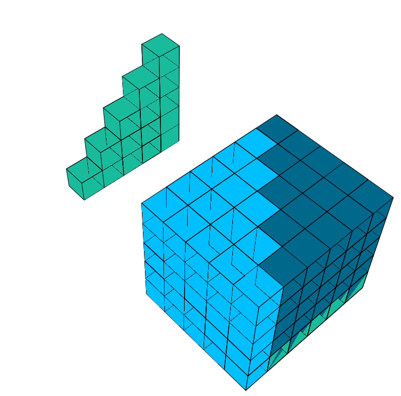
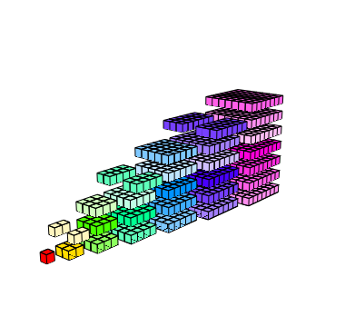

```{r setup, include=FALSE}
require(knitr)
require(kableExtra)
require(ggplot2)
require(reshape2)
require(rgl)

#Knitr table options
options(knitr.table.format = "html") 

#Chunk options
opts_chunk$set(echo = FALSE)
opts_chunk$set(results = 'asis')
opts_chunk$set(fig.width  = 4)
opts_chunk$set(fig.height = 4)
opts_chunk$set(fig.align='center')

#Knitr for rgl (3d)
#knit_hooks$set(webgl = hook_webgl)

#Function for authomatic theorem, corollary, example, counterexample, property, lemma and definition numbering
source("Rfun/theorem_creator.R")
```

#Dos problemas iniciales

##Un problema de intereses
Una cuenta de ahorro (por ejemplo la del retiro o para cuando metas a tu descendencia a la escuela) funciona más o menos de la siguiente manera: cada día primero de mes depositas una cantidad fija de $P$ pesos y cada fin de mes el banco te da $k$ \% del dinero que tenías al inicio. Aterrizándolo con números, cada mes depositas $100$ pesos y el banco te da $2$\% ($0.02 \times 100 \%$) del dinero total que tenías el mes anterior. Por ejemplo: la tabla \ref{depo} muestra el dinero que tienes durante el primer año

```{r, echo=FALSE, message=FALSE, warnings=FALSE, results='asis'}
dat <- data.frame(Mes = 1:5, 
                  Deposito = rep(100,5),
                  Intereses = c(0,2,4.04,6.1208,8.243216),
                  Saldo = c(100,202,306.04, 412.1608, 520.404016))
dat %>%
  kable("html") %>%
  kable_styling()
```

¿Cómo modelarías el saldo de tu cuenta al mes $n$? Lo que a mí se me ocurre es irlo sumando poco a poco:
\begin{equation}\nonumber
\begin{aligned}
	\textrm{Saldo inicio del Mes 1} & = \underbrace{100}_{\textrm{Depósito inicial}} \\
	\textrm{Saldo inicio del Mes 2} & = \underbrace{100}_{\textrm{Nuevo depósito}} + \underbrace{100}_{\textrm{Lo que ya tenía}} + \underbrace{0.2 \cdot 100 }_{\textrm{Intereses}} \\ & = 100 + 100 + 2 = 202. \\
	\textrm{Saldo inicio del Mes 3} & = \underbrace{100}_{\textrm{Nuevo depósito}} + \underbrace{202}_{\textrm{Lo que ya tenía}} + \underbrace{0.2 \cdot 202 }_{\textrm{Intereses}} \\ & = 100 + 202 + 4.04 = 306.04.
\end{aligned}
\end{equation}

¿Pero qué pasa si mi tasa ahora no es del $2\%$ sino de manera general del $k \cdot 100 \%$ con $0 < k < 1$ y estoy depositando no $1000$ pesos sino $P$ pesos? ¿Cómo obtener una fórmula de esto?

Intentamos desarrollar los meses de manera general. Para ello denotemos $S_n$ el saldo al finalizar el mes $n$:
\begin{equation}\nonumber
\begin{aligned}	
S_1 & = \underbrace{P}_{\textrm{Depósito inicial}} \\ \\ \\
S_2 & = \underbrace{P}_{\textrm{Nuevo depósito}} + \underbrace{S_1}_{\textrm{Lo que ya tenía}} + \underbrace{k \cdot S_1 }_{\textrm{Intereses}}  \\ 
& = P + (1 + k)S_1 \\
& = P + (1 + k) P  \\ \\ \\
S_3 & = \underbrace{P}_{\textrm{Nuevo depósito}} + \underbrace{S_2}_{\textrm{Lo que ya tenía}} + \underbrace{k \cdot S_2 }_{\textrm{Intereses}} 
\\ & = P + (1 + k)S_2
\\ & = P + (1 + k)\Big[ P + (1 + k) P \Big]
\\ & = P + (1 + k)P +  (1 + k)^2 P 
\end{aligned}
\end{equation}
Comprobamos el patrón que estamos viendo a ver si aparece en el mes $4$:
\begin{equation}\nonumber
\begin{aligned}
S_4 & = \underbrace{P}_{\textrm{Nuevo depósito}} + \underbrace{S_3}_{\textrm{Lo que ya tenía}} + \underbrace{k \cdot S_3}_{\textrm{Intereses}} 
\\ & = P + (1 + k)S_3
\\ & = P + (1 + k)\Big[ P + (1 + k)P +  (1 + k)^2 P  \Big]
\\ & = P + (1 + k) P + (1 + k)^2 P +  (1 + k)^3 P 
\end{aligned}
\end{equation}

Mi hipótesis es que, al mes $n$, el saldo en la cuenta estará dado por:
\begin{equation}\nonumber
	S_n = P + (1 + k) P + (1 + k)^2 P +  (1 + k)^3 P  + \dots +  (1 + k)^{n-2} P + (1 + k)^{n-1} P
\end{equation}
Nota que esto es una sumota y hacerlo a mano va a estar terrible si nuestro ahorro es, por ejemplo, a $20$ años (*i.e.* $240$ meses). Peor problema: dada una tasa $k = 0.5$ fija, supongamos que nos interesa saber el valor $P$ que tenemos que depositar cada mes para en $5$ años ($60$ meses) tener $50,000$ pesos. ¿Cómo le hacemos?

Éste es el problema que intentaremos resolver en esta sección de las notas. Para ello introduciremos notación que nos ayudará a manejar sumas así de grandes, veremos varios ejemplos de sumas y finalmente encontraremos un método para calcular rápidamente estas sumas (y de paso más propiedades de estos intereses). 

##La suma de los primeros enteros
Antes de intentar resolver la suma de la [sección anterior](#ahorro-para-el-viaje-a-acapulco) (que fue la que empezó todo esto) empezaremos con una pregunta más sencilla. ¿Cómo se ve la suma de los primeros $n$ números naturales? Es decir: ¿existirá una fórmula para $1 + 2 + 3 + \dots + n$? Cuenta la leyenda (y sólo es una leyenda) que cuando Gauß,  (Juan Carlos Federico Gauss o Charley para los cuates) era pequeño su maestro decidió castigarlo diciéndole que sumara los números del $1$ al $100$ y el niño obtuvo la fórmula y sumó todos los números rapidísimo ante el asombro del mundo entero. 

La forma en la que se encuentra esta fórmula es bastante creativa: comenzamos con enlistar los números del $1$ hasta el $n$:
\begin{equation}\nonumber
	1 + 2 + 3 + \dots + (n-2) + (n-1) + n;
\end{equation}
también los enlistamos al revés:
\begin{equation}\nonumber
	n + (n-1) + (n-2) + \dots + 3 + 2 + 1.
\end{equation}
Podemos sumar ambos:
\begin{equation}\nonumber
	\begin{aligned}
		               & 1 &+& 2 &+& 3 &+ \dots +& (n-2) &+& (n-1) &+& n \\
		+ \qquad & n &+& (n-1) &+& (n-2) &+ \dots +& 3 &+& 2 &+& 1 \\
		\hline 
						& (n+1) & + & (n + 1) & + & (n + 1) & + \dots +& (n + 1) & +&(n + 1) & +&(n + 1).
	\end{aligned}
\end{equation}
Tenemos entonces la igualdad siguiente:
\begin{equation}\nonumber
	(1 + 2 + \dots + n) + (1 + 2 + \dots + n) = n (n+1),
\end{equation}
la cual implica que
\begin{equation}\nonumber
	2 \cdot (1 + 2 + \dots + n) = n (n+1),
\end{equation}
y por tanto: 
\begin{equation}\nonumber
	 (1 + 2 + \dots + n) = \frac{n (n+1)}{2}.
\end{equation}
Esto nos lleva a plantear el teorema siguiente:

```{r}
teo <- "
Sea $1 + 2 + 3 + \\dots + n$ la suma de los primeros $n$ enteros positivos. Entonces se tiene la siguiente igualdad:
\\begin{equation}\\nonumber
1 + 2 + 3 + \\dots + n = \\frac{n(n+1)}{2}.
\\end{equation}
"

build_theorem("Teorema",teo, proof = "Todo lo anterior.", name = "Suma de primeros $n$ naturales", id ="sumanaturales" )
```

Nada más, por poner un ejemplo, consideremos la suma de los números $1 + 2 + \dots + 12$. Tenemos entonces que, usando la fórmula:
\begin{equation}\nonumber
1 + 2 + \dots + \underbrace{12}_{n} = \dfrac{12 (12 + 1) }{2} = 78.
\end{equation}
(-pausa en lo que checas con una calculadora que sí te dé-). Por supuesto que esta fórmula nos ayuda en ejemplos más complicados como el siguiente:

```{r}
ex <- "
Calcula la suma de los enteros desde $777$ hasta $1892$; es decir calcula:
\\begin{equation}\\nonumber
777 + 778 + 779 + \\dots + 1890 + 1891 + 1892.
\\end{equation}
"

sol <- "¡No tenemos fórmula para esto! Pero podemos sacarle la vuelta. Notamos que nuestra suma la podemos ver como la resta de dos sumas que sí tenemos:
\\begin{equation}\\nonumber
\\begin{aligned}
777 & + 778  + 779 + \\dots + 1890 + 1891 + 1892 
\\\\ & = \\underbrace{\\Big( 1 + 2 + 3 + \\dots + 1890 + 1891 + 1892 \\Big)}_{\\textrm{ la suma de los primeros } 1892 \\textrm{ enteros }} \\ & \\qquad - \\underbrace{\\Big( 1 + 2 + 3 + \\dots + 774 + 775 + 776 \\Big)}_{\\textrm{La suma de los primeros } 776}
\\\\ & = \\frac{1892 (1892 + 1)}{2} - \\frac{776 (776 + 1)}{2} 
\\\\ & = 1790778 - 301476
\\\\ & = 1489302
\\end{aligned}
\\end{equation}
"

build_theorem("Ejemplo",ex, proof = sol, name = "Una suma más complicada" )
```

El ejemplo muestra no sólo que las sumas salen de fórmulas sino que sumas específicas requieren de "trucos". En este caso el "truco" fue plantear la suma inicial como una suma a la cual se le resta otra y entonces sí aplicar la fórmula que sabemos. Por favor, no intentes memorizarte las fórmulas para las sumas: la única que necesitas memorizar es la geométrica; todas las demás lo importante es aprender el truco no la fórmula. ¡No te pierdas en eso!

#Cómo escribir una suma 

```{r}
adv <- "
Esta sección es muy importante así que asegúrate de entenderla bien. 
"

build_theorem("Advertencia",adv)
```

Es muy engorroso estar poniendo puntos suspensivos en la suma (como en [el teorema anterior](#un-problema-de-intereses) ) sobre todo en sumas en las que no es tan obvio cómo evolucionan los coeficientes. La pregunta principal es cómo denotar los sumandos. Una opción sería con letras. Por ejemplo, para la suma de los primeros $8$ enteros podríamos poner algo del estilo:
\begin{equation}\nonumber
a + b + c + d + e + f + g + h
\end{equation}
donde $a = 1$, $b = 2$, $c = 3$, $d = 4$, $e = 5$, $f = 6$, $g = 7$, $h = 8$. Esta notación, aparte de engorrosa es muy inútil: ¡imagina denotar la suma hasta el $178,967,651,666, 911,293$! Además de que se nos acabarían las letras sería horroroso tener tantos sumandos. Una opción es copiar la notación de vectores (por ejemplo un vector en $\mathbb{R}^2$ es $(x_1, x_2)$) y usar subíndices para representar los sumandos:
\begin{equation}\nonumber
	a_1 + a_2 + a_3 + \dots + a_{8}
\end{equation}
De tal forma que podemos representar de manera compacta la suma hasta el $178,967,651,666, 911,293$ haciendo:
\begin{equation}\nonumber
a_1 + a_2 + a_3 + \dots + a_{178,967,651,666, 911,293}.
\end{equation}
o bien, poniéndolo como $n$ e indicando quién es $n$ (para no acabar con subíndices TAAAN largos)
\begin{equation}\nonumber
	a_1 + a_2 + a_3 + \dots + a_{n}, \qquad n = 178,967,651,666, 911,293.
\end{equation}
Por último, para representar la suma $1 + 2 + 3 + \dots + n$ analizamos cómo son los sumandos en cada "paso" de la suma (*i.e.* como se ven las $a$ en cada paso). Es decir: en el primer paso $a_1$ estamos poniendo un $1$; en el paso $2$ correspondiente a $a_2$ estamos poniendo un $2$; en el paso $3$, relacionado a $a_3$ sumamos un $3$. De manera general en el paso $k$, asociado a una $a_k$ general, estaremos poniendo una $k$. Esto lo podemos poner de manera resumida como:
\begin{equation}\nonumber
\begin{aligned}
	\underbrace{a_1 + a_2 + a_3 + \dots + a_{n}}_{\text{La suma}}, & \qquad \underbrace{n = 178,967,651,666, 911,293}_{\text{Hasta dónde sumé}} 
	\\ \underbrace{a_k = k}_{\text{Cómo se ven los sumandos}}, & \underbrace{\qquad 1 \leq k \leq n}_{\text{De dónde a dónde va la suma}}.
\end{aligned}
\end{equation}
Como te darás cuenta esta notación es un rollo gigante. ¡Debería haber una forma más compacta de escribir esto! Para ello los matemáticos usan la letra griega $\Sigma$ (sigma mayúscula por suma *en alemán*). La forma en la que se utiliza es así:
\begin{equation}\nonumber
	\sum\limits_{k = 1}^{n} a_k
\end{equation}
donde la notación es: $a_k$ son las cosas a sumar (sumandos), $n$ es el índice del último sumando y $k$ es el índice del primer sumando. Es decir, $\sum\limits_{k = 1}^{n} a_k$ nos dice que debemos sumar los $a_k$ empezando en $1$ y hasta $n$. Por ejemplo:
\begin{equation}\nonumber
	\sum\limits_{k = 1}^{5} a_k = a_1 + a_2 + a_3 + a_4 + a_5
\end{equation}
mientras que 
\begin{equation}\nonumber
	\sum\limits_{k = 3}^{5} a_k =  a_3 + a_4 + a_5
\end{equation}
por otro lado: 
\begin{equation}\nonumber
	\sum\limits_{k = 3}^{7} a_k =  a_3 + a_4 + a_5 + a_6 + a_7
\end{equation}
o bien:
\begin{equation}\nonumber
	\sum\limits_{k = 2}^{5} a_k =  a_2 + a_3 + a_4 + a_5.
\end{equation}
En muchas ocasiones se dan "fórmulas"" para los $a_k$ de manera explícita. Por ejemplo, para escribir los números tal cual como en \eqref{sumaprimerosn}:
\begin{equation}\nonumber
	\sum\limits_{k = 1}^{n} \underbrace{k}_{a_k} = \underbrace{1}_{a_1} + \underbrace{2}_{a_2} + \underbrace{3}_{a_3} + \dots + \underbrace{n}_{a_n},
\end{equation}
en cuyo caso las $a_k$ (genéricas) son de la forma $a_k = k$; por ejemplo: 
\begin{equation}\nonumber
	\sum\limits_{k = 1}^{5} k = \underbrace{1}_{a_1} + \underbrace{2}_{a_2} + \underbrace{3}_{a_3} + \underbrace{4}_{a_4} + \underbrace{5}_{a_5},
\end{equation}
o bien
\begin{equation}\nonumber
	\sum\limits_{k = -7}^{-2} k = \underbrace{-7}_{a_{-7}} + \underbrace{(-6)}_{a_{-6}} + \underbrace{(-5)}_{a_{-5}} + \underbrace{(-4)}_{a_{-4}} + \underbrace{(-3)}_{a_{-3}} + \underbrace{(-2)}_{a_{-2}}.
\end{equation}
Las letras $k$ y $n$ en \eqref{sumbonito} no tienen nada de especial; las podemos reemplazar por letras diferentes (¡distintas!) y no pasa nada: 
\begin{equation}\nonumber
	\sum\limits_{i = 1}^{m} i = 1 + 2 + 3 + \dots + m.
\end{equation}
Otros ejemplo de suma interesante es:
\begin{equation}\nonumber
	\sum\limits_{i = 1}^{n} 1 = \underbrace{1 + 1 + \dots + 1}_{n \textrm{ unos en total}} = n,
\end{equation}
en el cual $a_1 = a_2 = \dots = a_n = 1$ todos los $a_i$ son $1$ (ojo son $a_i$ y no $a_k$ porque el índice de la suma en ésta es $i$).
Podemos tener una suma que cambia de signo sus sumandos:
\begin{equation}\nonumber
\begin{aligned}
	\sum\limits_{k = 1}^{n} (-1)^k & = \underbrace{-1}_{a_1} + \underbrace{(-1)^2}_{a_2} + \underbrace{(-1)^3}_{a_3} +\underbrace{(-1)^4}_{a_4} + \dots + \underbrace{(-1)^n}_{a_n} \\
	& = -1 + 1 - 1 + 1 + \dots + (-1)^n \\
	& = \begin{cases}
 0 & \textrm{ si } n \textrm{ es par},	\\
  -1 & \textrm{ si } n \textrm{ es non}.
 \end{cases}
\end{aligned}
\end{equation}
En este caso los $a_k = (-1)^k$. 

En un acto de rebeldía podemos intercambiar $n$ y $k$ porque son variables mudas que no afectan _el significado de la suma_:
\begin{equation}\nonumber
	\sum\limits_{n = 1}^{k} n^2  = \underbrace{1^2}_{a_1} + \underbrace{2^2}_{a_2} + \dots + \underbrace{k^2}_{a_k}
\end{equation}
En ese caso las $a_n$ (nota que son $a_n$ porque el índice de esta suma es $n$) están dadas por $a_n = n^2$. 

```{r}
nota <- "
Los $a_k$ son como denotamos 'genéricamente' a los sumandos de una suma. Como ya vimos en los párrafos anteriores, sumas diferentes tienen diferentes sumandos y por tanto diferentes $a_k$. Aterrizando esto un poco, en la suma:
\\begin{equation}\\nonumber
\\sum\\limits_{k = 1}^{n} 100^{k} = 100^1 + 100^2 + \\dots + 100^n
\\end{equation}
los sumandos son de la forma cien 'a la algo' por lo que genéricamente un sumando sería $a_k = 100^k$. Por otro lado, en la suma
\\begin{equation}\\nonumber
\\sum\\limits_{k = 1}^{n} \\tan k = \\tan 1 + \\tan 2 + \\dots + \\tan n
\\end{equation}
los sumandos son de la forma tangente 'de algo'. Un sumando genérico de esta suma sería $a_k = \\tan k$. 
"

build_theorem("Nota", nota, proof = "")
```

Estudiemos algunos ejemplos de sumas nada más por no dejar. 

```{r}
ex <- "
La suma:
\\begin{equation}\\nonumber
\\sum\\limits_{\\ell = 4}^{122} \\frac{1}{\\ell} = \\frac{1}{4} + \\frac{1}{5} + \\dots + \\frac{1}{122}.
\\end{equation}
En este caso los sumandos $a_{\\ell}$ son de la forma $a_{\\ell} =  \\frac{1}{\\ell}$. Intuitivamente los $a_{\\ell}$ representan la 'fórmula' a aplicar al sumando $\\ell$. 
"

build_theorem("Ejemplo", ex, proof = "")
```

```{r}
ex <- "
La suma:
\\begin{equation}\\nonumber
\\sum\\limits_{m = 4}^{j} \\frac{7 \\cdot m}{\\ln (m + 4)} =  \\frac{7 \\cdot 4}{\\ln (4 + 4)} + \\frac{7 \\cdot 5}{\\ln (5 + 4)}  + \\dots + \\frac{7 \\cdot j}{\\ln (4 + j)} 
\\end{equation}
En este caso los sumandos $a_m = \\frac{7m}{\\ln (m + 4)}$. 
"

build_theorem("Ejemplo", ex, proof = "")
```

```{r}
ex <- "
La suma:
\\begin{equation}\\nonumber
\\sum\\limits_{k = 1}^{n} (-1)^{k+1} \\frac{1}{k} = 1 - \\frac{1}{2} + \\frac{1}{3} - \\frac{1}{4} + \\frac{1}{5} - \\frac{1}{6} + \\dots + (-1)^{n+1} \\frac{1}{n}
\\end{equation}
En este caso los sumandos $a_k = (-1)^k \\frac{1}{k}$. 
"

build_theorem("Ejemplo", ex, proof = "")
```

```{r}
ex <- "
La suma:
\\begin{equation}\\nonumber
\\sum\\limits_{k = -4}^{4} 5 =  \\underbrace{5 + 5 + 5 + \\dots + 5}_{9 \\textrm{ veces}} = 9 \\cdot 5 = 45
\\end{equation}
En este caso los sumandos $a_k = 5$. La razón por la que tenemos $9$ cincos es porque estamos contando todos los enteros entre $-4$ y $4$ (son $9$ si no olvidas contar el $0$).  
"

build_theorem("Ejemplo", ex, proof = "")
```

```{r}
ex <- "
La suma hasta el $144$ de los números pares:
\\begin{equation}\\nonumber
\\sum\\limits_{k = 0}^{72} 2k = 2 + 4 + 6 + \\dots + 2\\cdot 71 + \\underbrace{2\\cdot 72}_{144}
\\end{equation}
En este caso los sumandos $a_k = 2k$. La razón por la que tenemos la suma hasta $72$ es porque $72 \\cdot 2$ nos manda al $144$; es decir, el $144$ es el $72$vo (septuagésimo segundo) par. 
"

build_theorem("Ejemplo", ex, proof = "")
```

```{r}
ex <- "
La suma hasta el $m$ de los números pares. En este caso tenemos dos opciones: si $m$ es par (en cuyo caso $m/2$ es entero) y si $m$ es impar (en cuyo caso $(m-1)/2$ es entero). 
\\begin{equation}\\nonumber
\\begin{cases}
\\sum\\limits_{n = 0}^{\\frac{m}{2}} 2n = 2 + 4 + 6 + \\dots + \\underbrace{2 \\cdot \\frac{m}{2}}_{ = m} & \\text{ si } m \\text{ par}, \\\\
\\sum\\limits_{n = 0}^{\\frac{m-1}{2}} 2n = 2 + 4 + 6 + \\dots + \\underbrace{2 \\cdot \\frac{(m-1)}{2}}_{ = m - 1 \\text{último par antes de } m} & \\text{ si } m \\text{ impar}.
\\end{cases}
\\end{equation}
En este caso los sumandos $a_n = 2n$. 
"

build_theorem("Ejemplo", ex, proof = "", name = "Una suma por casos")
```

```{r}
ex <- "
Supongamos que queremos representar la siguiente suma:
\\begin{equation}\\nonumber
1 + 2 + 4 + 5 + 6 + 7 + 8 + 9 + 10 + 11 + 12
\\end{equation}
esto es la suma de los primeros $12$ enteros <b>sin el $3$</b>. Una forma de denotar esto es poniendo la indicación de $\\neq 3$ <b>abajo</b> del operador suma y del indicador de de dónde a dónde va la suma. Es decir, la podemos escribir como:
\\begin{equation}\\nonumber
\\sum\\limits_{\\substack{j = 1 \\\\ j \\neq 3}}^{12} j = 1 + 2 + 4 + 5 + 6 + 7 + 8 + 9 + 10 + 11 + 12.
\\end{equation}
"

build_theorem("Ejemplo", ex, proof = "", name = "Notación para no sumar al que nos cae mal")
```

```{r}
ex <- "
Las sumas también pueden tener variables adicionales a una suma. Por ejemplo, podemos definir una función como suma:
\\begin{equation}\\nonumber
f(x) = \\sum\\limits_{i = 1}^{4} i x^{i} = x + 2x^2 + 3 x^3 + 4x^4
\\end{equation}
donde los $a_i = i x^{i}$. La función toma distintos valores; por ejemplo:
\\begin{equation}\\nonumber
f(3) = 3 + 2(3)^2 + 3(3)^3 + 4(3)^4 = 426
\\end{equation}
mientras que:
\\begin{equation}\\nonumber
f(1) = 1 + 2(1)^2 + 3(1)^3 + 4(1)^4 = 10
\\end{equation}
"

build_theorem("Ejemplo", ex, proof = "", name = "Series de potencias 1")
```

```{r}
ex <- "
Inclusive podemos combinar constantes (genéricas) con funciones y sumas:
\\begin{equation}\\nonumber
f(x) = \\sum\\limits_{i = 0}^{2} \\alpha_i x^{i} = \\alpha_0  + \\alpha_1 x + \\alpha_2 x^2
\\end{equation}
donde los $a_i = \\alpha_i x^{i}$ y los $\\alpha_0, \\alpha_1, \\alpha_2$ son constantes distintas. Ejemplos de funciones de este estilo son: 
\\begin{equation}\\nonumber
f(x) = 17 + 4x + 11x^2
\\end{equation}
donde $\\alpha_0 = 17, \\alpha_1 = 4$ y $\\alpha_2 = 11$. Otra función de este estilo es:
\\begin{equation}\\nonumber
f(x) = x^2
\\end{equation}
donde $\\alpha_0 = 0, \\alpha_1 = 0$ y $\\alpha_2 = 1$. 

De manera general, una función $f: \\mathbb{R} \\to \\mathbb{R}$ (que va de los reales en los reales) es un <b> polinomio de grado $n$ </b> si $f$ se escribe como:
\\begin{equation}\\nonumber
f(x) = \\sum\\limits_{k = 0}^{n} \\alpha_k x^k = \\alpha_0 + \\alpha_1 x + \\alpha_2 x^2 + \\alpha_3 x^3 + \\dots + \\alpha_n x^n.
\\end{equation}
"

build_theorem("Ejemplo", ex, proof = "", name = "Polinomios")
```

```{r}
ex <- "
Una forma más complicada de expresar sumas es cuando consideras sumas de sumas (sumas dobles):
\\begin{equation}\\nonumber
\\begin{aligned}
\\sum\\limits_{i = 1}^{5} \\left[ \\sum\\limits_{j = 1}^{i} \\frac{\\ln(i)}{j} \\right] & = \\sum\\limits_{j = 1}^{1} \\frac{\\ln(1)}{j} + \\sum\\limits_{j = 1}^{2} \\frac{\\ln(2)}{j} + \\sum\\limits_{j = 1}^{3} \\frac{\\ln(3)}{j} + \\sum\\limits_{j = 1}^{4} \\frac{\\ln(4)}{j} + \\sum\\limits_{j = 1}^{5} \\frac{\\ln(5)}{j} \\\\
& = \\frac{\\ln(1)}{1} + \\Big( \\frac{\\ln(2)}{1} + \\frac{\\ln(2)}{2} \\Big) +  \\Big( \\frac{\\ln(3)}{1} + \\frac{\\ln(3)}{2} + \\frac{\\ln(3)}{3} \\Big) \\\\ & + \\Big( \\frac{\\ln(4)}{1} + \\frac{\\ln(4)}{2} + \\frac{\\ln(4)}{3} + \\frac{\\ln(4)}{4}\\Big)  + \\Big( \\frac{\\ln(5)}{1} + \\frac{\\ln(5)}{2} + \\frac{\\ln(5)}{3} + \\frac{\\ln(5)}{4} + \\frac{\\ln(5)}{5}\\Big) 
\\end{aligned}
\\end{equation}
"

build_theorem("Ejemplo", ex, proof = "", name = "Sumas dobles")
```

Finalmente, después de haber visto muchas, procederemos a la definición de suma @zogaib: 

```{r}
def <- "
Dada una colección finita de números reales $\\{a_{k}, a_{k+1}, a_{k+2}, \\dots, a_{n} \\}$ (con $k \\leq n$) definimos la <b>suma finita</b> de dichos números como la expresión:
\\begin{equation}\\nonumber
\\sum\\limits_{i = k}^{n} a_{i} = a_{k} + a_{k+1} + \\dots + a_{n},
\\end{equation}
donde $i = k, k + 1, \\dots, n$ denota el <b>índice</b> de la suma, $a_{i}$ representa el $i$-ésimo sumando ($j = k, k + 1, \\dots, n$), $k$ es el <b>índice inferior</b> y $n$ el <b>índice superior</b>.
"

build_theorem("Definición", def, proof = "", "Suma finita")
```


```{r}
nota <- '
Por cuestiones de edición (formato de párrafos) muchas veces denotamos la suma
\\begin{equation}\\nonumber
\\sum\\limits_{i = k}^{n} a_{i}
\\end{equation}
como $\\sum_{i = k}^{n} a_{i}$ (con los subíndices a la derecha y no exactamente arriba). No hay diferencia. Por otro lado, cuando es "obvio" que $i$ va desde $k$ hasta $n$ muchas veces la gente se salta el $k$ y el $n$ de la ecuación y pone:
\\begin{equation}\\nonumber
\\sum\\limits_{i} a_{i}
\\end{equation}
o bien: $\\sum a_{i}$. Como a mí jamás me parece obvio quién es la $i$ no haré eso (pero lo digo porque seguro la vida te pondrá cosas así). 

Un último ejemplo de cómo la gente denota las sumas (que no usaremos en esta clase) es con conjuntos. A veces en lugar de usar índices se utilizan los conjuntos de donde salieron los $a_k$. Por ejemplo en el conjunto $\\mathcal{C} = \\{  1, 2, 3, \\dots, 19 \\}$ tenemos que $a_1 = 1$, $a_2 = 2$, $a_3 = 3$, etcétera hasta $a_{19} = 19$. En este caso la notación sería:
\\begin{equation}\\nonumber
\\sum\\limits_{a_k \\in \\mathcal{C}} a_k = 1 + 2 + 3 +\\dots + 19.
\\end{equation}
Esto es bastante útil cuando no hay una receta para cómo escribir los números. Por ejemplo si $\\mathcal{P}$ es el conjunto de números primos (para los que no existe una fórmula que permita encontrarlos) entonces podemos escribir:
\\begin{equation}\\nonumber
\\sum\\limits_{p \\in \\mathcal{P}} \\frac{1}{p} = \\frac{1}{2} + \\frac{1}{3} + \\frac{1}{5} + \\frac{1}{7} + \\dots.
\\end{equation}
'

build_theorem("Nota", nota)
```

#Técnicas para reducir sumas

En esta sección vamos a intentar deducir formas de obtener fórmulas para sumas interesantes. Como veremos no hay un solo "truco" que salga bien o una técnica única. Mucho de las sumas es de creatividad, de tener la idea. La forma de desarrollar esa creatividad es haciendo muchas sumas así que ¡adelante!

##Sumas como áreas o volúmenes

###Suma de los primeros $n$ enteros
Uno de los trucos más interesantes para una suma es verla desde una perspectiva geométrica como área o volumen. Para poner un ejemplo de lo que quiero decir, considera de nuevo la suma de los primeros $n$ enteros.
\begin{equation}\nonumber
\sum\limits_{k = 1}^{n} k = 1 + 2 + \dots + n
\end{equation}
La suma de los primeros $n$ enteros es equivalente al área generada por $\sum_{k = 1}^{n} k$ cuadrados de longitud $1$. El chiste de todo es saber cómo acomodar esos cuadrados. Por simplificar la idea, consideremos $n = 10$ y supongamos queremos calcular la suma $1 + 2 + \dots + 10$ (que ya sabemos es $55$ ¿cierto?). Una forma de
acomodar los cuadrados para que vayan *ad-hoc* con la suma es como una pirámide alineada a la izquierda:

```{r}

#Create matrix diagonal of ones to put tiles
mynplot <- function(n, size = 100/n, showlines = FALSE){
  
  mat <- data.frame(lower.tri(matrix(NA, ncol = n, nrow = n), diag = TRUE))
  mat <- sapply(mat, as.numeric)
  colnames(mat) <- c(1:n)
  rownames(mat) <- c(1:n)
  mat <- melt(mat)
  
  myplot <- ggplot(data = mat)+
            geom_tile( aes(Var2, Var1, fill = value), color = "white") + theme_classic() +
            scale_y_reverse(breaks = 1:n) +
            scale_fill_gradient2(low = "white", high = "#18bc9c", mid = "white", 
                                 midpoint = 0) + 
            theme(legend.position = "none", axis.line.y = element_blank(), axis.line.x = element_blank(), 
                  axis.ticks.x = element_blank(), axis.text.x = element_blank(), axis.ticks.y = element_blank(), axis.text.y = element_text(size = size)) +
            xlab("") + ylab("")
  
  if (showlines){
    myplot <- myplot + 
      geom_polygon(aes(x = x, y = y), fill = "#2c3e50", alpha = 0.5, 
                   data = data.frame(x = c(0.5, n + 0.5, 0.5, 0.5), y = c(0.5, n + 0.5, n + 0.5, 0.5))) 
     
  }
  
  return(myplot)
}

mynplot(10)
```

Nota que el área de la pirámide es relativamente fácil de calcular pues es un triángulo (pirámide grande) unido a $10$ triangulitos (ver figura abajo). El triángulo grande mide de base $10$ y de altura $10$ por lo que su área es $10 \times 10 / 2 = 50$ mientras que los pequeños como vienen de cuadrados que miden $1$ cada uno de ellos mide $1/2$ y por tanto los $10$ triangulitos tienen área (conjunta) de $5$ por lo que el área total de la pirámide es $55$ y por lo tanto la suma es $55$. 

```{r}
mynplot(10, showlines = TRUE)
```

Este mismo argumento se puede hacer para la suma de $n$ enteros considerando triángulos más grandes:

```{r}
mynplot(100)
```

La fórmula general será:
\begin{equation}\nonumber
\text{Área del grande} + n \cdot \text{Área de los pequeños} = \frac{n \cdot n}{2} + n \frac{1}{2} = \frac{n(n+1)}{2}
\end{equation}
de donde obtenemos el mismo resultado que ya teníamos pero por otro camino. ¡Genial! 


###Suma de cuadrados

Para la suma de cuadrados, una opción (presentada por @siu1984proof) es considerar pirámides de cubos unitarios donde el número de cubos en cada piso corresponde con el número de piso cuadrado. Así en el primer piso habrá $1^2 = 1$ cubo; en el segundo piso, $2^2 = 4$ cubos; en el tercero, $3^2 = 9$ cubos y así sucesivamente (ver figura abajo). El volumen de la pirámide debería corresponder con la suma de cuadrados:
\begin{equation}\nonumber
1^2 + 2^2 + 3^2 + \dots + n^2 = \sum\limits_{k = 1}^{n} k^2.
\end{equation}

```{r,results='hide'}
n <- 5

#To get parameters from obsrrved
# zoom<-par3d()$zoom
#userMatrix<-par3d()$userMatrix
#windowRect<-par3d()$windowRect

open3d(zoom = 1, 
       userMatrix = structure(c(0.6789630651474, -0.567207217216492, 0.466138660907745, 0, -0.733713150024414, -0.501765966415405, 0.458144247531891, 0, -0.025970246642828, -0.653075039386749, -0.756847679615021, 0, 0, 0, 0, 1), .Dim = c(4L, 4L)), 
       windowRect=c(20, 30, 400, 400))
for (i in 1:n){
    mygrid <- expand.grid(1:i,1:i)
    for (j in 1:nrow(mygrid)){
      c3d <- translate3d(scale3d(cube3d(color="#18bc9c", alpha= 1, lit = FALSE, lwd = 1),0.5,0.5,0.5), x = mygrid[j,1], y = mygrid[j,2], z = i-1)
      shade3d(c3d)   # render the object 
      c3d$material$color <- "black"
      wire3d(c3d)   # render the object 
    }
}
rgl.postscript("images/sumsquares1.svg","svg") 
snapshot3d("images/sumsquares1.png")
```

<!--html preserve-->
<p align="center"></p>
<!--/html preserve-->

A mí de la pirámide sola no se me ocurre qué hacer (¿a ti sí?); empero, podemos generar 3 pirámides idénticas sólo que rotadas y trasladadas para armar una especie de rompecabezas con ellas:

```{r,results='hide'}
open3d(zoom = 1, 
       userMatrix = structure(c(0.6789630651474, -0.567207217216492, 0.466138660907745, 0, -0.733713150024414, -0.501765966415405, 0.458144247531891, 0, -0.025970246642828, -0.653075039386749, -0.756847679615021, 0, 0, 0, 0, 1), .Dim = c(4L, 4L)), 
       windowRect=c(20, 30, 400, 400))

  for (i in 1:n){
    mygrid <- expand.grid(1:i,1:i)
    for (j in 1:nrow(mygrid)){
      c3d <- translate3d(scale3d(cube3d(color="#18bc9c", alpha= 1, lit = FALSE, lwd = 1),0.5,0.5,0.5), x = mygrid[j,1], y = mygrid[j,2], z = i-1)
      shade3d(c3d)   # render the object 
      c3d$material$color <- "black"
      wire3d(c3d)   # render the object 
    }
  }

  for (i in 1:n){
    mygrid <- expand.grid(1:i,1:i)
    for (j in 1:nrow(mygrid)){
      c3d <- translate3d(scale3d(cube3d(color="deepskyblue4", alpha= 1, lit = FALSE, lwd = 1),0.5,0.5,0.5), x = n + i, y =  mygrid[j,2], z =   mygrid[j,1] - 1)
      shade3d(c3d)   # render the object 
      c3d$material$color <- "black"
      wire3d(c3d)   # render the object 
    }
  }

  for (i in 1:n){
    mygrid <- expand.grid(1:i,1:i)
    for (j in 1:nrow(mygrid)){
      c3d <- translate3d(scale3d(cube3d(color="deepskyblue", alpha= 1, lit = FALSE, lwd = 1),0.5,0.5,0.5), x =  mygrid[j,1] + 1, y = n + i, z =   mygrid[j,2] - 1)
      shade3d(c3d)   # render the object 
      c3d$material$color <- "black"
      wire3d(c3d)   # render the object 
    }
  }
rgl.postscript("images/sumsquares2.svg","svg") 
snapshot3d("images/sumsquares2.png")
```

<!--html preserve-->
<p align="center"></p>
<!--/html preserve-->

Notamos que casi forman un cubo; de hecho, podemos pegar las pirámides para generar casi un cubo perfecto (excepto por un lado). 

```{r,results='hide'}
open3d(zoom = 1, 
       userMatrix = structure(c(0.414745718240738, -0.790823578834534, -0.450093686580658, 0, -0.903975188732147, -0.414624661207199, -0.104477949440479, 0, -0.103996247053146, 0.450205028057098, -0.886848211288452, 0, 0, 0, 0, 1), .Dim = c(4L, 4L)), 
       windowRect=c(20, 30, 800, 800))

  for (i in 1:n){
    mygrid <- expand.grid(1:i,1:i)
    for (j in 1:nrow(mygrid)){
      c3d <- translate3d(scale3d(cube3d(color="#18bc9c", alpha= 1, lit = FALSE, lwd = 1),0.5,0.5,0.5), x = mygrid[j,1], y = mygrid[j,2], z = i-1)
      shade3d(c3d)   # render the object 
      c3d$material$color <- "black"
      wire3d(c3d)   # render the object 
    }
  }

  for (i in 1:n){
    mygrid <- expand.grid(1:i,1:i)
    for (j in 1:nrow(mygrid)){
      c3d <- translate3d(scale3d(cube3d(color="deepskyblue4", alpha= 1, lit = FALSE, lwd = 1),0.5,0.5,0.5), x = i + 1, y =  mygrid[j,2], z =   mygrid[j,1] - 1)
      shade3d(c3d)   # render the object 
      c3d$material$color <- "black"
      wire3d(c3d)   # render the object 
    }
  }

  for (i in 1:n){
    mygrid <- expand.grid(1:i,1:i)
    for (j in 1:nrow(mygrid)){
      c3d <- translate3d(scale3d(cube3d(color="deepskyblue", alpha= 1, lit = FALSE, lwd = 1),0.5,0.5,0.5), x =  mygrid[j,1] + 1, y = 1 + i, z =   mygrid[j,2] - 1)
      shade3d(c3d)   # render the object 
      c3d$material$color <- "black"
      wire3d(c3d)   # render the object 
    }
  }
rgl.postscript("images/sumsquares3.svg","svg") 
snapshot3d("images/sumsquares3.png")
```

<!--html preserve-->
<p align="center"></p>
<!--/html preserve-->

Notamos entonces que el volumen total de tres pirámides es el mismo que el de un prisma cuadrangular de volumen $n^2 \cdot (n + 1)$ y de una escalera (ver figura abajo). La escalera tiene una característica primordial: su volumen es la suma de los volúmenes de los cubos que la conforman y tenemos $1$ cubo para su primer piso, $2$ para el segundo, $3$ para el tercero por lo cual el volumen de dicha escalera coincide con la suma $1 + 2 + 3 +\dots + n = \sum_{k=1}^{n} k$ que ya calculamos previamente. 

```{r,results='hide'}
open3d(zoom = 1, 
       userMatrix = structure(c(0.6789630651474, -0.567207217216492, 0.466138660907745, 0, -0.733713150024414, -0.501765966415405, 0.458144247531891, 0, -0.025970246642828, -0.653075039386749, -0.756847679615021, 0, 0, 0, 0, 1), .Dim = c(4L, 4L)), 
       windowRect=c(20, 30, 800, 800))

  for (i in 1:n){
    mygrid <- expand.grid(1:i,1:i)
    for (j in 1:nrow(mygrid)){
      c3d <- translate3d(scale3d(cube3d(color="deepskyblue4", alpha= 1, lit = FALSE, lwd = 1),0.5,0.5,0.5), x = i + 1, y =  mygrid[j,2], z =   mygrid[j,1] - 1)
      shade3d(c3d)   # render the object 
      c3d$material$color <- "black"
      wire3d(c3d)   # render the object 
    }
  }

  for (i in 1:n){
    mygrid <- expand.grid(1:i,1:i)
    for (j in 1:nrow(mygrid)){
      c3d <- translate3d(scale3d(cube3d(color="deepskyblue", alpha= 1, lit = FALSE, lwd = 1),0.5,0.5,0.5), x =  mygrid[j,1] + 1, y = 1 + i, z =   mygrid[j,2] - 1)
      shade3d(c3d)   # render the object 
      c3d$material$color <- "black"
      wire3d(c3d)   # render the object 
    }
  }


  for (i in 1:n){
    mygrid <- expand.grid(1:i,1:i)
    for (j in 1:nrow(mygrid)){
      c3d <- translate3d(scale3d(cube3d(color="#18bc9c", alpha= 1, lit = FALSE, lwd = 1),0.5,0.5,0.5), x = mygrid[j,1] + 1, y = mygrid[j,2], z = i-1)
      shade3d(c3d)   # render the object 
      c3d$material$color <- "black"
      wire3d(c3d)   # render the object 
    }
  }

  for (i in 1:n){
    for (j in 1:i){
      c3d <- translate3d(scale3d(cube3d(color="#18bc9c", alpha= 1, lit = FALSE, lwd = 1),0.5,0.5,0.5), x = -4, y = j, z = i-1)
      shade3d(c3d)   # render the object 
      c3d$material$color <- "black"
      wire3d(c3d)   # render the object 
    }
  }
rgl.postscript("images/sumsquares4.svg","svg") 
snapshot3d("images/sumsquares4.png")
```

<!--html preserve-->
<p align="center"></p>
<!--/html preserve-->

De lo anterior concluimos que:
\begin{equation}\nonumber
\begin{aligned}
\textrm{Volumen de tres pirámides } & = \underbrace{n \cdot (n+1)}_{\textrm{Prisma cuadrangular}} + \underbrace{\sum\limits_{k=1}^{n} k}_{\textrm{Escalera}}
\\ & = n^2 \cdot (n+1) + \frac{n(n+1)}{2} = n \big( n^2 + \frac{3}{2}n + \frac{1}{2} \big) = \frac{n}{2} (2n + 1) \cdot (n + 1),
\end{aligned}
\end{equation}
de donde se sigue que:
\begin{equation}\nonumber
\sum\limits_{k=1}^{n} k^2 = \textrm{Volumen de una pirámide} = \frac{n \cdot (2n + 1) \cdot (n + 1)}{6} .
\end{equation}

Este proceso puede generalizarse a cualquier $n$. 

###Suma de cubos

La suma de los primeros $n$ cubos es más fácil de ver geométricamente que la de los cuadrados. Evaluaremos la suma:
\begin{equation}\nonumber
\sum\limits_{i=1}^{n} i^3
\end{equation}
Para ello consideramos los cubos literalmente como cubos geométricos formados (a su vez) por cubos unitarios. De esta forma la suma $1 + 2^3 + 3^3 + 4^3 + \dots + n^3$ la podemos interpretar como la suma de los volúmenes de cubos de lado respectivo $1,2,3,4,$ etcétera. Esto lo podemos representar en la siguiente figura:

```{r,results='hide'}
n <- 7
open3d(zoom = 1, 
       userMatrix = structure(c(-0.00147341936826706, 0.956580817699432, 0.291463732719421, 0, 0.758786678314209, -0.188772395253181, 0.623384296894073, 0, 0.651337683200836, 0.22207747399807, -0.725562453269958, 0, 0, 0, 0, 1), .Dim = c(4L, 4L)), 
       windowRect=c(20, 30, 400, 400))
altura <- 0
cubecolor <- rainbow( n ) 
for (c in 1:n){
    for (i in 1:c){
      for (j in 1:c){
        for (k in 1:c){
          if (j %in% c(1,c) || k %in% c(1,c) || i %in% c(1,c) ){ #Plot only surroundings
              c3d <- translate3d(scale3d(cube3d(color=cubecolor[c], alpha= 1, lit = FALSE, lwd = 1),0.5,0.5,0.5), x = j, y = k, z = altura + i)
              shade3d(c3d)   # render the object 
              c3d$material$color <- "black"
              wire3d(c3d)   # render the object 
          }
        }
      }
    }
  altura <- altura + c + 1
}
rgl.postscript("images/sumcubes1.svg","svg") 
snapshot3d("images/sumcubes1.png")
```

<!--html preserve-->
 <p align="center"></p>
<!--/html preserve-->

El _truco_ consiste en advertir que dichos cubos los podemos partir en capas 

```{r, results = 'hide'}
open3d(zoom = 1, 
       userMatrix = structure(c(-0.00147341936826706, 0.956580817699432, 0.291463732719421, 0, 0.758786678314209, -0.188772395253181, 0.623384296894073, 0, 0.651337683200836, 0.22207747399807, -0.725562453269958, 0, 0, 0, 0, 1), .Dim = c(4L, 4L)), 
       windowRect=c(20, 30, 400, 400))
altura <- 0
cubecolor  <- rainbow(n)
cubecolor2 <- rainbow(n, s = 0.25, alpha = 0.1)

for (c in 1:n){
  ccolor <- colorRampPalette(c(cubecolor[c],cubecolor2[c]))(ceiling(c/2) + 1)
  for (k in 1:c){
    for (j in 1:c){
      for (i in 1:c){
        color <- ccolor[((ceiling(c/2) -k)  %% (ceiling(c/2) + 1)) + 1]
          
          #Caso par separa la última columna
          if (c %% 2 == 0 & k == c){
            if (j > c/2){ypos <- j + 1} else {ypos <- j - 1}
          } else {ypos <- j}
          
          c3d <- translate3d(scale3d(cube3d(color=color, alpha= 1, lit = FALSE, lwd = 1),0.5,0.5,0.5), x = 2*k, y = ypos, z = altura + i)
          shade3d(c3d)   # render the object 
          c3d$material$color <- "black"
          wire3d(c3d)   # render the object 
        
      }
    }
  }
  altura <- altura + c + 1
}
rgl.postscript("images/sumcubes2.svg","svg")  #Not working in this case
snapshot3d("images/sumcubes2.png")
```

<!--html preserve-->
 <p align="center"></p>
<!--/html preserve-->

Y de nuevo armarlos como rompecabezas en un cuadrado gigante de longitud $1 + 2 + 3 + \dots + n$:

```{r, results='hide'}
open3d(zoom = 1, 
       userMatrix = structure(c(-0.540337085723877, 0.364717662334442, -0.758298814296722, 0, 0.838446378707886, 0.309430152177811, -0.448621153831482, 0, 0.0710203796625137, -0.878199279308319, -0.472992956638336, 0, 0, 0, 0, 1), .Dim = c(4L, 4L)), 
       windowRect=c(20, 30, 400, 400))
pos <- 0
cubecolor  <- rainbow(n)
cubecolor2 <- rainbow(n, s = 0.25, alpha = 0.1)
for (c in 1:n){
  ccolor <- colorRampPalette(c(cubecolor2[c],cubecolor[c]))(ceiling(c/2) + 1)
  for (i in 1:(c + pos)){
    for (j in 1:(c + pos)){
      if (i <= c + pos || j <= c + pos){
        
        #Caso impar colorea los primeros k
        if (c %% 2 == 0){
          if (j <= pos){
            color <- ccolor[floor((j-1 + 0.5*c)/c) + 1]
          } else if (i <= pos){
            color <- ccolor[floor((i-1 + 0.5*c)/c) + 1]
          } else {
            color <- cubecolor[c]
          }
        }
        
        #Caso impar colorea los primeros k
        if (c %% 2 == 1){
          if (j <= pos){
            color <- ccolor[floor((j-1)/c) + 1]
          } else if (i <= pos){
            color <- ccolor[floor((i-1)/c) + 1]
          } else {
            color <- cubecolor[c]
          }
        }
        
        c3d <- translate3d(scale3d(cube3d(color=color, alpha = 1, lit = FALSE, lwd = 1),0.5,0.5,0.5), x = i, y = j, z = 0)
        shade3d(c3d)   # render the object 
        c3d$material$color <- "black"
        wire3d(c3d)   # render the object 
      }
    }
  }
  pos <- pos + c
}
rgl.viewpoint( theta = 0, phi = 0, fov = 60, zoom = 1, interactive = TRUE )
#rgl.postscript("images/sumcubes3.svg","svg")  #Not working in this case
snapshot3d("images/sumcubes3.png")
```

<!--html preserve-->
 <p align="center"></p>
<!--/html preserve-->

Por lo cual la suma de cubos es el cuadrado de la suma de enteros:
\begin{equation}\nonumber
\sum\limits_{k = 1}^{n} k^3 = \Big( \sum\limits_{k=1}^{n} k \Big)^2 = \frac{n^2 (n+1)^2}{4}.
\end{equation}


##Sumas telescópicas

Las sumas telescópicas son sumas particulares que la gente encontró se resuelven fácilmente. Por poner un ejemplo (súuuper falso) consideremos la suma:
\begin{equation}\nonumber
\sum\limits_{n = 1}^{3606201} \sqrt{n + 1} - \sqrt{n}
\end{equation}
Observamos que si expandimos los primeros términos tenemos algo del estilo:
\begin{equation}\nonumber
\sum\limits_{n = 1}^{3606200} \sqrt{n + 1} - \sqrt{n} = \Big( \sqrt{2} - \sqrt{1} \Big) + \Big( \sqrt{3} - \sqrt{2} \Big) + \Big( \sqrt{4} - \sqrt{3} \Big) + \dots + \Big( \sqrt{3606201} - \sqrt{3606200} \Big) 
\end{equation}
(-Pausa en lo que encuentras el patrón-). Observa que la mayor parte de los términos se acaban anulando en el siguiente sumando (primero están sumando y luego restando). Los únicos que no se anulan son $-\sqrt{1}$ y $\sqrt{3606201}$ por lo que tenemos:
\begin{equation}\nonumber
\sum\limits_{n = 1}^{3606200} \sqrt{n + 1} - \sqrt{n} =  \sqrt{3606201} - \sqrt{1} = 1898.
\end{equation}
Otro ejemplo de una suma que se resuelve de esta manera es la siguiente:
```{r}
ej <- "
\\begin{equation}\\nonumber
\\sum\\limits_{n = 1}^{k} e^{-n} - e^{1-n}
\\end{equation}
"
sol <- "
Expandimos la suma:
\\begin{equation}\\nonumber
\\sum\\limits_{n = 1}^{k} e^{-n} - e^{1-n} = \\Big( e^{-1} - e^{0}\\Big) +  \\Big( e^{-2} - e^{-1}\\Big) +  \\Big( e^{-3} - e^{-2}\\Big) + \\dots +  \\Big( e^{-k} - e^{1-k}\\Big)
\\end{equation}
donde vemos que todos los términos se anulan excepto el $-e^{0}$ y el $e^{-k}$ de donde se sigue que:
\\begin{equation}\\nonumber
\\sum\\limits_{n = 1}^{k} e^{-n} - e^{1-n} =  e^{-k} - e^{0} = e^{-k} - 1.
\\end{equation}
"

build_theorem("Ejemplo", ej, sol, id = "sumas_telescopicas")
```

Muchas veces, las telescópicas  surgen de manipulaciones como en el ejemplo siguiente:
\begin{equation}\nonumber
\sum\limits_{n = 1}^{k} \ln \Big( \frac{k+1}{k} \Big)
\end{equation}
Donde utilizamos que $\ln \frac{a}{b} = \ln a - \ln b$ (-pausa mientras recuerdas esto-) para obtener:
\begin{equation}\nonumber
\sum\limits_{k = 1}^{\ell} \ln \Big( \frac{k+1}{k} \Big) = \sum\limits_{k = 1}^{\ell} \ln (k+1) - \ln(k) = \ln(\ell + 1)
\end{equation}

Una suma más complicada de ver como telescópica es:
\begin{equation}\nonumber
\sum\limits_{k = 0}^{n} 2^k;
\end{equation}
empero, notamos que $2^{k+1} - 2^{k} = 2^{k} \cdot (2 - 1) = 2^k$ de donde reescribimos la suma como:
\begin{equation}\nonumber
\sum\limits_{k = 0}^{n} 2^k = \sum\limits_{k = 0}^{n} 2^{k+1} - 2^{k} = 2^{n+1} - 1
\end{equation}

El poder de las series telescópicas no debe ser subestimado. Por ejemplo, apoyándonos en ellas podemos probar el siguiente teorema:

```{r}
ej <- "
Tenemos la siguiente identidad para la suma de múltiplos de ángulos: 
\\begin{equation}\\nonumber
\\sum\\limits_{n = 0}^{k} \\cos (n \\theta) = \\dfrac{\\sin \\Big( (k + \\frac{1}{2}) \\theta \\Big)}{2 \\sin\\Big( \\frac{\\theta}{2} \\Big)} +  \\dfrac{1}{2}
\\end{equation}
cuando $\\theta \\neq 2k\\pi$ para $k$ entero (-pausa en lo que piensas por qué se impuso esta condición-). 
"

sol <- "
Consideremos las sumas:
\\begin{equation}\\nonumber
\\mathcal{S}_k = \\sum\\limits_{n = 0}^{k} \\cos (n \\theta)
\\end{equation}
y multipliquémoslas por $2 \\sin \\Big( \\frac{\\theta}{2} \\Big)$:
\\begin{equation}\\nonumber
2 \\sin \\Big( \\frac{\\theta}{2} \\Big) \\mathcal{S}_k = \\sum\\limits_{n = 0}^{k} 2 \\sin \\Big( \\frac{\\theta}{2} \\Big) \\cos (n \\theta) =  \\sum\\limits_{n = 0}^{k}  \\underbrace{\\sin \\Big( (n + \\frac{1}{2})\\theta \\Big) - \\sin \\Big( (n - \\frac{1}{2})\\theta \\Big) }_{2 \\cos \\theta \\sin \\phi = \\sin (\\theta + \\phi) - \\sin(\\theta - \\phi)} 
\\end{equation}
donde usamos la <a href='https://en.wikipedia.org/wiki/List_of_trigonometric_identities#Product-to-sum_and_sum-to-product_identities'>identidad trigonométrica:</a> $2 \\cos \\theta \\sin \\phi = \\sin (\\theta + \\phi) - \\sin(\\theta - \\phi)$. Notamos que nos queda una suma telescópica:
\\begin{equation}\\nonumber
\\begin{aligned}
2 \\sin \\Big( \\frac{\\theta}{2} \\Big) \\mathcal{S}_k & = \\sum\\limits_{n = 0}^{k} \\sin \\Big( (n + \\frac{1}{2})\\theta \\Big) - \\sin \\Big( (n - \\frac{1}{2})\\theta \\Big) 
\\\\ & = \\Big( \\sin \\big( \\frac{1}{2} \\theta \\big) - \\sin \\big( - \\frac{1}{2}\\theta \\big) \\Big) +  \\Big( \\sin \\big( \\frac{3}{2} \\theta \\big) - \\sin \\big( \\frac{1}{2} \\theta) \\big) \\Big) \\\\ & \\qquad + \\Big( \\sin \\big( \\frac{5}{2}\\theta \\big) - \\sin \\big( \\frac{3}{2}\\theta )  \\big) \\Big) + \\dots + \\Big( \\sin \\big( (k + \\frac{1}{2} )  \\theta \\big) - \\sin \\big( ( k - \\frac{1}{2} )\\theta \\big) \\Big) 
\\\\ & =  \\sin \\big( (k + \\frac{1}{2} )  \\theta \\big)  - \\sin  (- \\frac{1}{2} \\theta).
\\end{aligned}
\\end{equation}
Finalmente, al dividir por $2 \\sin \\Big( \\frac{\\theta}{2} \\Big)$ (que sabemos es $\\neq 0$ -pausa en lo que ves por qué-)
\\begin{equation}\\nonumber
\\begin{aligned}
\\mathcal{S}_k & = \\frac{\\sin \\big( (k + \\frac{1}{2} )  \\theta \\big)}{2 \\sin \\Big( \\frac{\\theta}{2} \\Big)}  - \\frac{\\sin  (- \\frac{1}{2} \\theta)}{2 \\sin \\Big( \\frac{\\theta}{2} \\Big)} 
\\\\ & = \\frac{\\sin \\big( (k + \\frac{1}{2} )  \\theta \\big)}{2 \\sin \\Big( \\frac{\\theta}{2} \\Big)}  + \\frac{\\sin  ( \\frac{1}{2} \\theta)}{2 \\sin \\Big( \\frac{\\theta}{2} \\Big)}
\\\\ & = \\frac{\\sin \\big( (k + \\frac{1}{2} )  \\theta \\big)}{2 \\sin \\Big( \\frac{\\theta}{2} \\Big)}  + \\frac{1}{2}.
\\end{aligned}
\\end{equation}
"

build_theorem("Teorema",ej, sol, name = "Identidad trigonométrica de Lagrange", id = "lagrange")
```


```{r}
ej <- "
En general una suma telescópica $\\sum\\limits_{k= 1}^{n} a_k$ con $i < n$ tiene sumandos de la forma $a_k = b_{k} - b_{k-1}$ por lo que el valor al final de la suma es:
\\begin{equation}\\nonumber
\\sum\\limits_{k = 1}^{n} a_i = b_{n} - b_{0}
\\end{equation}
pues 
\\begin{equation}\\nonumber
\\sum\\limits_{k = 1}^{n} a_i = \\sum\\limits_{k = 1}^{n} [ b_k - b_{k-1} ] = [b_1 - b_0] + [b_2 - b_1] + [b_3 - b_2] + \\dots + [b_n - b_{n-1}].
\\end{equation}
Por ejemplo en la suma: $\\sum_{k=1}^{12} k^3 - (k-1)^3$  los $a_k$ son $k^3 - (k-1)^k$, los $b_k$ son, respectivamente: $b_{k} = k^3$ y $b_{k-1} = (k-1)^3$ y $n = 12$. El resultado de la suma es:
\\begin{equation}\\nonumber
\\sum_{k=1}^{12} k^3 - (k-1)^3 = \\underbrace{12^3}_{b_n} - \\underbrace{0^3}_{b_0} = 1728.
\\end{equation}
"

build_theorem("Nota",ej)
```

Como dato curioso (adicional) de acuerdo con @neto2017excursion el nombre de sumas telescópicas se debe a que de la misma manera en que un telescopio acorta la distancia entre los orbes celestes y nuestros ojos, la suma telescópica reduce la distancia entre ciertas sumas y sus resultados (haciendo que sumemos menos).

Las sumas telescópicas son súper poderosas. Muchas veces podemos transformar una suma que no es *nada obvio* que es telescópica en una telescópica [telescopiquear(?)] como muestra el siguiente ejemplo:

```{r}
ej <- "
De nuevo consideremos la suma de los primeros $n$ números pero resolvámosla por el método de sumas telescópicas. 
\\begin{equation}\\nonumber
\\sum\\limits_{k = 1}^{n} k
\\end{equation}
"
sol <- "
Los sumandos en esta suma son de la forma $a_k = k$ y los queremos escribir como $a_k = b_{k} - b_{k-1}$ para que quede telescópica. <i>A priori</i> no se me ocurren quiénes pueden ser esos $b_k$ pero podemos empezar proponiendo unos que nos den algo muy cercano. Lo que quiero es que los sumandos $b_k$ menos $b_{k-1}$ me den $k$ (o casi $k$). Una idea que se me ocurre es usar polinomios pues noto que:
\\begin{equation}\\nonumber
k^2 - (k-1)^2 = k^2 - k^2 + 2k - 1 =  2k - 1
\\end{equation}
que es casi $k$, donde $\\beta_k = k^2$ de tal forma que $\\beta_k - \\beta_{k-1} = k^2 - (k-1)^2 = 2k - 1$ (estoy usando $\\beta$ porque no son los $b$ que quiero pero casi...). Vamos a jugar con los $\\beta$ para ver cómo eliminar el $2$ y el $-1$ y obtener finalmente todo en términos de $a_k = k$. Para eliminar el $2$ puedo experimentar dividiendo entre $2$ de tal forma que una mejor propuesta para los $\\beta_k$ es $\\beta_k = \\frac{k^2}{2}$:
\\begin{equation}\\nonumber
\\underbrace{\\frac{k^2}{2}}_{\\beta_k} - \\underbrace{\\frac{(k-1)^2}{2}}_{\\beta_{k-1}} = \\frac{k^2}{2} - \\frac{k^2 - 2k + 1}{2} = k - \\frac{1}{2}.
\\end{equation}
Aún no obtengo el $k$ pero ya estoy más cerca. Lo único que falta por hacer es eliminar el $\\frac{1}{2}$. Para ello lo primero que se me ocurre es restar a cada $\\beta_k$ $1/2$. Por lo que propongo $\\beta_k = \\frac{k^2 - 1}{2}$. De donde saco:
\\begin{equation}\\nonumber
\\underbrace{\\frac{k^2 - 1}{2}}_{\\beta_k} - \\underbrace{\\frac{(k-1)^2 - 1}{2}}_{\\beta_{k_1}} = \\frac{k^2 - 1}{2} - \\frac{k^2 - 2k}{2} = k - \\frac{1}{2}.
\\end{equation}
¡La situación no mejora! Entonces agregar el $-1/2$ a los términos no era la opción. Me quedo pensando un rato y me doy cuenta que si los términos $\\beta_k$ tuvieran un $k$ entonces al restar $\\beta_k - \\beta_{k-1}$ se irían los $k$ y me quedaría sólo el $1$ (házlo y ve que no miento). Entonces se me ocurre escribir $\\beta_k = \\frac{k^2 + k}{2}$
\\begin{equation}\\nonumber
\\frac{k^2 + k}{2} - \\frac{(k-1)^2 + (k-1)}{2} = \\frac{k^2 + k}{2} - \\frac{k^2 - 2k + 1 + k - 1}{2} = k.
\\end{equation}
Finalmente, propongo como $b_k = \\frac{k^2 + k}{2}$. Reescribo entonces la suma como una telescópica:
\\begin{equation}\\nonumber
\\sum\\limits_{k = 1}^{n} k = \\sum\\limits_{k = 1}^{n} \\underbrace{\\left[ \\frac{k^2 + k}{2} -  \\frac{(k-1)^2 + (k-1)}{2} \\right]}_{b_k - b_{k-1}} = 
 \\underbrace{\\frac{n^2 + n}{2}}_{b_n} -  \\underbrace{\\frac{0^2 + 0}{2} }_{b_0} = \\frac{n(n+1)}{2}.
\\end{equation}
que era el resultado que obtuvimos antes.
"

build_theorem("Ejemplo", ej, sol, name = "Telescopiqueando sumas")
```

La moraleja del ejemplo anterior es que hay muchas sumas que son telescópicas "escondidas" y que la forma de verlo es "a ojo de buen cubero". 

##Sumas geométricas

```{r}
georema <- "
La suma geométrica será una de las más importantes de tu vida, no la pierdas de vista. 
"

build_theorem("Advertencia", georema)
```

Imagina que tienes un coche que inicialmente costó $P$ y que año con año se devalúa un $s \cdot 100\%$; es decir tras su devaluación el precio al primer año será $P - s P$; en el segundo año será $P - s P - s \cdot s P$; en el tercero: $P - s P - s^2 P - s \cdot s^2 P$, etcétera. El precio del coche al año $n$ lo podemos escribir como:
\begin{equation}\nonumber
\begin{aligned}
P - \sum\limits_{k = 1}^{n} (s)^k P & = P - \Big( s P + s^2 P + s^3 P + s^4 P + \dots + s^n P \Big)
\\ & = P - P \Big( s + s^2 + s^3 + \dots + s^n )
\\ & = P \Bigg( 1 - \sum\limits_{k = 1}^{n} s^k \Bigg).
\end{aligned}
\end{equation}
Analicemos la suma $\mathcal{S} = \sum\limits_{k = 1}^{n} s^k$:
\begin{equation}\nonumber
\mathcal{S} = s + s^2 + s^3 + \dots + s^n
\end{equation}
si multiplicamos por $s$ tenemos:
\begin{equation}\nonumber
\begin{aligned}
s \mathcal{S} & = s \Big( s + s^2 + s^3 + \dots + s^n \Big) 
\\ & = s^2 + s^3 + \dots + s^{n+1}
\\ & = \mathcal{S} - s + s^{n+1} \quad \text{(-pausa en lo que compruebas-)}.
\end{aligned}
\end{equation}
Pasando el $s\mathcal{S}$ del otro lado:
\begin{equation}\nonumber
\begin{aligned}
& \mathcal{S} -  s \mathcal{S} & = s - s^{n+1}  \\
\Rightarrow & (1 - s) \mathcal{S} & = s - s^{n+1} 
\end{aligned}
\end{equation}
de donde si $s \neq 1$ tenemos que:
\begin{equation}\nonumber
 \mathcal{S} = \frac{s - s^{n+1}}{1-s}.
\end{equation}
El caso en el que $s = 1$ es trivial (lo podemos ver en la fórmula de $\mathcal{S}$):
\begin{equation}\nonumber
\sum\limits_{k = 1}^{n} s^k = \sum\limits_{k = 1}^{n} 1^k = \sum\limits_{k = 1}^{n} 1 = n
\end{equation}
Llegamos entonces al siguiente teorema:

```{r}
georema <- "
La suma dada por $\\mathcal{S} = \\sum\\limits_{k = 1}^{n} s^k$ tiene los siguientes valores:
\\begin{equation}\\nonumber
 \\sum\\limits_{k = 1}^{n} s^k = \\begin{cases}
\\frac{s - s^{n+1}}{1-s} & \\textrm{ si } s \\neq 1, \\\\
n & \\textrm{ si } s = 1.
\\end{cases}
\\end{equation}
"

build_theorem("Teorema", georema, proof = "Lo anterior", "Suma geométrica")
```

```{r}
georema <- "
Los valores de la serie geométrica dependen de tu valor inicial. En el teorema anterior empezamos desde $1$; sin embargo, si hubiéramos empezado en $0$ tendríamos que:
\\begin{equation}\\nonumber
\\begin{aligned}
 \\sum\\limits_{k = 0}^{n} s^k & = s^0 + \\sum\\limits_{k = 1}^{n}  \\\\& = 1 + 
\\begin{cases}
\\frac{s - s^{n+1}}{1-s} & \\textrm{ si } s \\neq 1, \\\\
n & \\textrm{ si } s = 1.
\\end{cases} \\\\&= 
\\begin{cases}
\\frac{s - s^{n+1}}{1-s} + 1 & \\textrm{ si } s \\neq 1, \\\\
n + 1 & \\textrm{ si } s = 1.
\\end{cases}  \\\\&=
\\begin{cases}
\\frac{s - s^{n+1}}{1-s} + \\frac{1-s}{1-s} & \\textrm{ si } s \\neq 1, \\\\
n + 1 & \\textrm{ si } s = 1.
\\end{cases}  \\\\&=
\\begin{cases}
\\frac{1 - s^{n+1}}{1-s} & \\textrm{ si } s \\neq 1, \\\\
n + 1 & \\textrm{ si } s = 1.
\\end{cases}
\\end{aligned}
\\end{equation}
"

build_theorem("Nota", georema)
```

Finalmente, volviendo al teorema del coche obtenemos que, en particular, el precio del coche al añó $n$ estará dado por:
\begin{equation}\nonumber
P\Big( 1 - \sum\limits_{k = 1}^{n} s^k \Big) = P \Big( 1 - \frac{s - s^{n+1}}{1 - s}\Big) = P \Big( \frac{1 - 2s - s^{n+1}}{1 -s}\Big)
\end{equation}
siempre y cuando la depreciación del coche sea menor al $100\%$ (*i.e.* $s = 1$).


```{r}
ejemplo <- "
Considerar la suma:
\\begin{equation}\\nonumber
\\sum\\limits_{i = 1}^{122} \\frac{1}{3^2}.
\\end{equation}
¿cuál es su valor?
"

solucion <- "
Podemos escribir 
\\begin{equation}\\nonumber
\\sum\\limits_{i = 1}^{122} \\frac{1}{3^2} = \\sum\\limits_{i = 1}^{122} \\Big( \\frac{1}{3} \\Big)^2
\\end{equation}
e identificar que es una geométrica con parámetros $r = \\frac{1}{3}$, $n = 122$ y que empieza en $1$ por lo cual, usando el teorema anterior:
\\begin{equation}\\nonumber
\\sum\\limits_{i = 1}^{122} \\frac{1}{3^2} = \\dfrac{\\frac{1}{3} - \\frac{1}{3^{123}}}{1 - \\frac{1}{3}} =  \\dfrac{\\frac{1}{3} - \\frac{1}{3^{123}}}{\\frac{2}{3}} =  \\dfrac{1 - \\frac{1}{3^{122}}}{2} \\approx 0.5
\\end{equation}

"

build_theorem("Ejemplo", ejemplo, proof = solucion)
```

Muchas veces el que algo sea una suma geométrica no es tan obvio y se requieren manipulaciones algebraicas para descubrirla como es el caso de la siguiente suma:

```{r}
teo <- "
Escribe la suma
\\begin{equation}\\nonumber
\\sum\\limits_{k = 1}^{n} k x^k 
\\end{equation}
en términos de $n$ y $x$. 
"

demo <- "
Resolveremos la demostración haciendo dos casos. Lo importante de las demostraciones por casos es que debemos asegurarnos que los casos cubran todas las posibilidades. En este ejemplo eso ocurre pues $x = 1$ o $x \\neq 1$, no hay de otra. 


<p><b> [Caso $x = 1$] </b>
El primer caso es el más fácil, si $x = 1$ tenemos entonces que la suma es:
\\begin{equation}\\nonumber
\\sum\\limits_{k = 1}^{n} k x^k = \\sum\\limits_{k = 1}^{n} k 1^k  = \\sum\\limits_{k = 1}^{n} k 
\\end{equation}
donde ya sabemos que $\\sum\\limits_{k = 1}^{n} k = \\frac{n(n+1)}{2}$ por lo que el problema ya lo resolvimos. </p>


<p><b> [Caso $x \\neq 1$] </b>
Recordamos que $\\frac{d}{dx} x^k =k x^{k-1}$ por lo que podemos escribir $k x^k$ como: $k x^k =x \\cdot k x^{k-1} = x \\cdot \\Big(\\frac{d}{dx} x^k \\Big)$ de donde tenemos que:
\\begin{equation}\\nonumber
\\begin{aligned}
\\sum\\limits_{k = 1}^{n} k x^k & = \\sum\\limits_{k = 1}^{n} x \\cdot \\Big(\\frac{d}{dx} x^k \\Big) 
\\\\ &  =  \\underbrace{x}_{\\text{No depende de } k} \\cdot \\sum\\limits_{k = 1}^{n} \\Big(\\frac{d}{dx} x^k \\Big) 
\\\\ &  = x \\cdot \\frac{d}{dx}  \\underbrace{\\Big( \\sum\\limits_{k = 1}^{n}  x^k \\Big)}_{\\text{Geométrica}}
\\\\ &  = x \\cdot \\frac{d}{dx} \\Big( \\frac{x - x^{n+1}}{1-x} \\Big) 
\\\\ &  = x \\cdot  \\Big( \\frac{\\big(1 - (n+1)x^n \\big)\\cdot (1-x) - (-1)\\cdot\\big(x - x^{n+1} \\big) }{(1-x)^2} \\Big) 
\\\\ &  = x \\cdot  \\Big( \\frac{1 - (n+1)x^n - x + (n+1)x^{n+1}  + x - x^{n+1} }{(1-x)^2} \\Big)
\\\\ &  = x \\cdot  \\Big( \\frac{1 - (n+1)x^n  + nx^{n+1}}{(1-x)^2} \\Big)
\\\\ &  =  \\frac{x - (n+1)x^{n+1}  + nx^{n+2}}{(1-x)^2}.
\\end{aligned}
\\end{equation}
donde usamos que la derivada de una suma (finita) es la suma de las derivadas. Puedes ver <a href='http://www.objetos.unam.mx/matematicas/leccionesMatematicas/03/3_026/index.html' >este link</a> si no recuerdas eso.</p>

De todo lo anterior concluimos que:
\\begin{equation}\\nonumber
\\sum\\limits_{k = 1}^{n} k x^k = \\begin{cases}
 \\frac{x - (n+1)x^{n+1}  + nx^{n+2}}{(1-x)^2} & \\text{ si } x \\neq 1, \\\\
\\frac{n(n+1)}{2} & \\text{ si } x = 1.
\\end{cases}
\\end{equation}
"

build_theorem("Ejemplo", teo, proof = demo, name = "Truco de la derivada", id = "trucoderivada")
```


### Solución al problema del interés compuesto
Ahora que somos muy buenos en la evaluación de sumas, recordemos la planteada al inicio:
\begin{equation}\nonumber
	S_n = P + (1 + k) P + (1 + k)^2 P +  (1 + k)^3 P  + \dots +  (1 + k)^{n-2} P + (1 + k)^{n-1} P
\end{equation}
Usemos nuestro conocimiento de las $\Sigma$ para escribirlos de manera más compacta: 
\begin{equation}\nonumber
	S_n = \sum\limits_{i = 0}^{n-1} P (1 + k)^{i} 
\end{equation}
donde podemos sacar la $P$:
\begin{equation}\nonumber
	S_n = P \sum\limits_{i = 0}^{n-1} (1 + k)^{i} 
\end{equation}
Notamos que el lado derecho es una suma geométrica:
\begin{equation}\nonumber
	S_n = \begin{cases} 
 	P \Big( \frac{1 - (1 + k)^{n}}{1 - (1 + k)} \Big) & \textrm{ si } k \neq 0 \\
 	nP & \textrm{ si } k = 0
 \end{cases}
\end{equation}
y por tanto:
\begin{equation}\nonumber
	S_n =  \begin{cases}
	P \Big( \frac{(1 + k)^{n}}{k} - \frac{1}{k} \Big) & \textrm{si } k \neq 0 \\
	 nP & \textrm{ si } k = 0 	
  \end{cases}
\end{equation}

Nota que el resultado que da [Wolfram Alpha](https://www.wolframalpha.com/input/?i=sum+P*(1+%2B+k)%5Ej+from+j+%3D+0+to+n-1) es incompleto: no nos da el caso si $k = 0$.  Finalmente, sea $k = 0.05$ y consideremos que nos interesa ver cuánto $P$ debemos depositar de manera mensual en un periodo para en $60$ meses tener $50000$ pesos. Para ello sustituimos en \eqref{sumachiquita}:
\begin{equation}\nonumber
\begin{aligned}
	& 50000 && =  P \Big( \frac{(1 + 0.05)^{60}}{0.05} - \frac{1}{0.05} \Big) \\ \\
	\Rightarrow & P && = \frac{50000}{\Big( \frac{(1 + 0.05)^{60}}{0.05} - \frac{1}{0.05} \Big)} \approx 141.41
\end{aligned}
\end{equation}

##Sumas aritméticas

Las sumas aritméticas pueden (de inicio) parecer poco útiles; empero veremos (ejemplos más adelante) que de hecho son bastante buenas. Una **suma aritmética de primer orden** es aquella donde la diferencia entre los sumandos es siempre la misma constante. Por poner un ejemplo considera la suma (que va sumando $5$ cada vez):
\begin{equation}\nonumber
7 + 12 + 17 + 22 + 27 + 32 + \dots + 5552
\end{equation}
Notamos que los sumandos, $a_k$ cumplen que $a_{k+1} - a_k =  5$; es decir, la diferencia entre los sumandos siempre es la misma constante. Denotaremos la diferencia entre los sumandos como:
\begin{equation}\nonumber
\Delta_{k}^{(1)} = a_{k} - a_{k-1} = 5.
\end{equation}
(el $(1)$ quedará claro más adelante cuando veamos sumas aritméticas de orden mayor). La observación importante es el análisis de cómo progresan los sumandos. Notamos que $a_1 = 7$ y de ahí $a_2 = a_1 + 5$ mientras que $a_3 = a_2 + 5 = a_1 + 2 \cdot 5$, por otro lado, $a_4 = a_3 + 5 = a_1 + 3 \cdot 5$; en general el $k$-ésimo sumando lo podemos ver como:
\begin{equation}\nonumber
a_k = a_1 + (k-1) \cdot \Delta_{k}^{(1)}
\end{equation}
Usando esto podemos reescribir la suma original como:
\begin{equation}\nonumber
\begin{aligned}
\sum\limits_{k = 1}^{n} \Big(a_1 + (k-1) \cdot \Delta_{k}^{(1)} \Big) 
   & = \sum\limits_{k = 1}^{n} a_1 +\Delta_{k}^{(1)} \cdot \sum\limits_{k = 1}^{n} (k-1) 
\\ & = n \cdot a_1 + \Delta_{k}^{(1)} \cdot \underbrace{\sum\limits_{k = 1}^{n-1} k}_{\text{(verifica)}}
\\ & = n \cdot a_1 + \Delta_{k}^{(1)}\cdot \frac{(n-1)n}{2}
\\ & = \frac{n}{2}  \cdot \Big(2 a_1 + \Delta_{k}^{(1)} \cdot (n-1) \Big)
\end{aligned}
\end{equation}
Finalmente, notamos que el término $a_n$ está dado por: $a_n = a_1 + (n-1) \Delta_{1}$ y que $a_1 + a_n = 2a_1 + (n-1)\Delta_{1}$ por lo que podemos sustituir en la fórmula anterior y tener:
\begin{equation}\nonumber
\begin{aligned}
\sum\limits_{k = 1}^{n} \Big(a_1 + (k-1) \cdot \Delta_{k}^{(1)} \Big) & =  \frac{n}{2}  \cdot \Big(2 a_1 + \Delta_{k}^{(1)} \cdot (n-1) \Big)
\\ & = \frac{n}{2} \cdot ( a_1 + a_n )
\end{aligned}
\end{equation}
En particular, en nuestro caso $n = 1110$ (-pausa en lo que compruebas-) $a_n = 5552$, $a_1 = 7$ y $\Delta_{k}^{(1)} = 5$ por lo que:
\begin{equation}\nonumber
7 + 12 + 17 + 22 + 27 + 32 + \dots + 5552 = \frac{1110}{2} \cdot \Big( 7 + 5552 \Big) = 3085245.
\end{equation}

```{r}
ej <- "
Consideremos la suma de los primeros $n$ números y resolvámosla como aritmética.
\\begin{equation}\\nonumber
\\sum\\limits_{k = 1}^{n} k
\\end{equation}
"
sol <- "
Notamos que en esta suma los sumandos $a_k$ cumplen que $a_k - a_{k-1} = 1$ por lo que $\\Delta^{(1)}_{k} = 1$. Podemos escribir entonces un sumando $a_k$ genérico como: $a_k = a_1 + (k-1) \\Delta^{(1)}_{k}$ y por la misma lógica que el párrafo anterior tenemos que:
\\begin{equation}\\nonumber
\\sum\\limits_{k = 1}^{n} k = \\sum\\limits_{k = 1}^{n} \\left[ a_1 + (k-1) \\Delta^{(1)}_{k} \\right] = \\frac{n}{2} \\cdot ( a_1 + a_n ) =  \\frac{n}{2} \\cdot ( 1 + n ) 
\\end{equation}
El cual es el resultado que ya conocíamos de antes. 
"

build_theorem("Ejemplo", ej, sol)
```

Las sumas aritméticas de primer orden pueden parecer simples. Las más interesantes son las sumas de mayor orden. Consideremos un problema mucho más complicado: deducir la fórmula en términos de $n$ para la suma de cuadrados de impares:
\begin{equation}\nonumber
\sum\limits_{k = 0}^{n} (2k + 1)^2
\end{equation}
Notamos que en este caso los sumandos $a_k$ son de la forma: $a_k = (2k + 1)^2$. Ésta no es una suma aritmética de primer orden pues la diferencia de los términos no es una constante:
\begin{equation}\nonumber
\Delta_k^{(1)} = a_k - a_{k-1} = (2k + 1)^2 - \big(2(k-1) + 1\big)^2 = 8k
\end{equation}
¡Oh gran desgracia! Podemos sentarnos en un chayote a llorar o bien podemos analizar la diferencia de las diferencias:
\begin{equation}\nonumber
\Delta_k^{(2)} = \Delta_k^{(1)} - \Delta_{k-1}^{(1)} = 8k - 8(k-1) = 8
\end{equation}
¡Esta sí es constante! (De hecho la suma es una *aritmética de segundo orden*; de manera general una suma es *aritmética de orden $j$* si la suma de la $j$-ésima diferencia de diferencias es constante). La pregunta entonces es ¿cómo usar que la diferencia de las diferencias es constante para resolver la suma? (-no sé tú, yo saqué una hoja para ponerme a explorar cómo podría hacerse-) 

Analizamos los sumandos de la serie (nota que empieza en $k = 0$) y vemos cómo se ven las diferencias (renglón de abajo):
\begin{equation}\nonumber
1, 9, 25, 49, 81, 121, \dots, (2n+1)^2
\end{equation}

Las diferencias entre términos (las $\Delta_k^{(1)} = 8k$), incluyendo el primer término, son:
\begin{equation}\nonumber
1, 8, 16, 24, 32, 40, \dots, 8n
\end{equation}
Nota que los sumandos de la serie original los podemos escribir en términos de ésta (que es aritmética de primer orden):
\begin{equation}\nonumber
\begin{aligned}
1 & = 1 \\
9 & = 1 + 8 \\
25 & = 1 + 8 + 16 \\
49 & = 1 + 8 + 16 + 24 \\
81 & = 1 + 8 + 16 + 24 + 32\\
121 & = 1 + 8 + 16 + 24 + 32 + 40 \\
\vdots & = \ddots \\
(2n+1)^2 & =1 + 8 + 16 + 24 + 32 + 40 + \dots + 8(n-1)
\end{aligned}
\end{equation}
O bien escrito con la notación de suma:
\begin{equation}\nonumber
\begin{aligned}
1 & = 1 + \sum\limits_{k=0}^{0} 8k \\
9 & = 1 + \sum\limits_{k=0}^{1} 8k\\
25 & = 1 + \sum\limits_{k=0}^{2} 8k \\
49 & = 1 + \sum\limits_{k=0}^{3} 8k \\
81 & = 1 + \sum\limits_{k=0}^{4} 8k \\
121 & = 1 + \sum\limits_{k=0}^{5} 8k \\
\vdots & = \vdots \\
(2n+1)^2 & = 1 + \sum\limits_{k=1}^{n-1} 8k
\end{aligned}
\end{equation}
Por lo que podemos ver la suma $\sum_{k = 1}^{n} (2k+1)^2 = 1  + 9 + 25 + 49 + \dots + (2n+1)^2$ como una suma de sumas (propiamente, una suma doble):
\begin{equation}\nonumber
\begin{aligned}
\sum\limits_{k = 0}^{n} (2k+1)^2 & =  \sum\limits_{j = 1}^{n} \Big[ 1 + \sum\limits_{k = 0}^{j-1} 8k \Big] \\
& =  \sum\limits_{j = 1}^{n} \Big[ 1 + 8 \sum\limits_{k = 0}^{j-1} k \Big] \\
& =  \sum\limits_{j = 1}^{n} \Big[ 1 + 4 (j-1) \cdot j \Big] \\
& =  \sum\limits_{j = 1}^{n}  1 + 4 \sum\limits_{j = 1}^{n} \Big[ (j-1) \cdot j \Big] \\
& =  n + 4 \sum\limits_{j = 1}^{n} \Big[ j^2 - j \Big] \\
& =  n + 4 \Bigg[ \sum\limits_{j = 1}^{n} j^2 -  \sum\limits_{j = 1}^{n} j\Bigg] \\
& =  n + 4 \Bigg[ \frac{n(n+1)(2n+1)}{6} -   \frac{n(n+1)}{2}\Bigg] \\
& =  n + 4n(n+1) \Bigg[ \frac{(2n+1)}{6} -   \frac{1}{2}\Bigg] \\
& =  n + 4n(n+1) \Bigg[ \frac{n}{3} + \frac{1}{6} -   \frac{3}{6}\Bigg] \\
& =  n + 4n(n+1) \Bigg[ \frac{n}{3}  -   \frac{1}{3}\Bigg] \\
& =  n + \frac{4}{3} n(n+1)(n-1) \\
& =  n \big[1 + \frac{4}{3}(n+1)(n-1)\big] \\
& =  \frac{n(2n + 1)(2n-1)}{3} \\
\end{aligned}
\end{equation}
De donde concluimos el siguiente teorema de la suma de cuadrados de impares:

```{r}
teo <- "
La suma de cuadrados de los primeros $n$ impares está dada por:
\\begin{equation}\\nonumber
\\sum\\limits_{k = 1}^{n} (2k + 1)^2 = \\frac{n(2n + 1)(2n-1)}{3}
\\end{equation}
"

build_theorem("Teorema",teo, proof = "Todo lo anterior.", name = "Suma de cuadrados de los primeros $n$ impares")
```

##Usar sumas dobles

Este truco puede parecer una insensatez pues consiste en escribir una suma que no sabemos resolver como dos sumas; empero, el propósito de todo esto es que las dos sumas sean más sencillas y las sepamos resolver. Veamos cómo funciona:

```{r}
teo <- "
Considera la suma:
\\begin{equation}\\nonumber
\\sum\\limits_{k = 1}^{n} k 2^k 
\\end{equation}
y escríbela en términos de $n$ el número de sumandos. 
"

demo <- "
Comenzamos expandiendo la suma:
\\begin{equation}\\nonumber
\\begin{aligned}
\\sum\\limits_{k = 1}^{n} k 2^k & = 1 \\cdot 2^1 + 2 \\cdot 2^2 + 3 \\cdot 2^3 + 4 \\cdot 2^4 + \\dots + 2^n
\\\\ & = 2^1 + \\Big[ 2^2 + 2^2 \\Big] + \\Big[ 2^3 + 2^3 + 2^3 \\Big] + \\Big[ 2^4 + 2^4 + 2^4 + 2^4 \\Big] + \\dots + \\underbrace{\\Big[ 2^n + 2^n + \\dots + 2^n \\Big]}_{n \\text{ veces}}
\\end{aligned}
\\end{equation}
Aprovechamos que nuestra suma es una suma de sumas por lo que podemos escribir (-verifícalo-):
\\begin{equation}\\nonumber
\\begin{aligned}
\\sum\\limits_{k = 1}^{n} k 2^k & = \\sum\\limits_{k = 1}^{n} \\sum\\limits_{i = 1}^{k} 2^k 
\\\\& =2^1 + \\Big[ 2^2 + 2^2 \\Big] + \\Big[ 2^3 + 2^3 + 2^3 \\Big] + \\Big[ 2^4 + 2^4 + 2^4 + 2^4 \\Big] + \\dots + \\underbrace{\\Big[ 2^n + 2^n + \\dots + 2^n \\Big]}_{n \\text{ veces}}
\\end{aligned}
\\end{equation}
Podemos reordenar los términos de la suma como:
\\begin{equation}\\nonumber
\\begin{aligned}
\\sum\\limits_{k = 1}^{n} \\sum\\limits_{i = 1}^{k} 2^k  & 
= 2^1 + \\Big[ 2^2 + 2^2 \\Big] + \\Big[ 2^3 + 2^3 + 2^3 \\Big] + \\Big[ 2^4 + 2^4 + 2^4 + 2^4 \\Big] + \\dots + \\underbrace{\\Big[ 2^n + 2^n + \\dots + 2^n \\Big]}_{n \\text{ veces}}
\\\\ & = \\Big[ 2^1 + 2^2 + 2^3 + \\dots + 2^n \\Big] + \\Big[ 2^2 + 2^3 + \\dots + 2^n \\Big] + \\dots + \\Big[ 2^{n-1} + 2^n \\Big] + \\Big[ 2^n \\Big] 
\\\\ & = \\sum\\limits_{i = 1}^{n} \\sum\\limits_{k = i}^{n} 2^k
\\end{aligned}
\\end{equation}
Donde evaluamos la suma interior:
\\begin{equation}\\nonumber
\\begin{aligned}
\\sum\\limits_{k = i}^{n} 2^k & = \\underbrace{\\sum\\limits_{k = 1}^{n} 2^k}_{\\text{Geométrica}} - \\underbrace{\\sum\\limits_{k = 1}^{i-1} 2^k}_{\\text{Geométrica}} 
\\\\ & = 2^{n+1} - 2 - \\big( 2^{i} - 2 \\big) 
\\\\ & = 2^{n+1} - 2^{i}
\\end{aligned}
\\end{equation}
Sustituyendo éste valor para la suma interior en la doble suma tenemos que:
\\begin{equation}\\nonumber
\\begin{aligned}
\\sum\\limits_{i = 1}^{n} \\sum\\limits_{k = i}^{n} 2^k & = \\sum\\limits_{i = 1}^{n} \\Big[ 2^{n+1} - 2^{i} \\Big]
\\\\ & = \\sum\\limits_{i = 1}^{n} 2^{n+1} - \\sum\\limits_{i = 1}^{n}  2^{i}
\\\\ & = n 2^{n+1} - \\underbrace{ \\sum\\limits_{i = 1}^{n}  2^{i} }_{\\text{Geométrica}}
\\\\ & = n 2^{n+1} - \\big( 2^{n+1} - 2 \\big)
\\\\ & = (n-1) 2^{n+1} + 2
\\end{aligned}
\\end{equation}
Por lo cual:
\\begin{equation}\\nonumber
\\sum\\limits_{k = 1}^{n} k 2^k  = (n-1) 2^{n+1}  + 2
\\end{equation}
Nota (no es trivial verlo pero después de cálculos sale) que el resultado de este ejercicio coincide con el obtenido en el <a href = '#trucoderivada'> ejercicio con el truco de la derivada</a> cuando $x = 2$. 
"

build_theorem("Ejemplo", teo, proof = demo, name = "Usar doble suma", id = "doblesuma")
```

En particular, usar sumas dobles es bastante útil para hacer sumas de enteros elevados a una potencia entera. Es decir, sumas de la forma: $\sum\limits_{k=1}^{n} k^m$ donde $m$ es un entero salen con sumas dobles. Veamos un ejemplo:

```{r}
teo <- "
Considera la suma:
\\begin{equation}\\nonumber
\\sum\\limits_{k = 1}^{n} k^2
\\end{equation}
y escríbela en términos de $n$ el número de sumandos. 
"

demo <- "
Todo el truco consistirá en escribir la suma como una doble suma que sea sencilla de resolver:
\\begin{equation}\\nonumber
\\begin{aligned}
\\sum\\limits_{k = 1}^{n} k^2 & = 1^2 + 2^2 + 3^2 + \\dots + n^2
\\\\ & = 1 + 2\\cdot 2 + 3 \\cdot 3 + 4 \\cdot 4 + \\dots + n \\cdot n
\\\\ & = 1 + [1 + 1]\\cdot 2 + [1 + 1 + 1] \\cdot 3 + [1 + 1 + 1 + 1] \\cdot 4 + \\dots + \\underbrace{[1 + 1 + \\dots + 1]}_{n\\text{ veces}} \\cdot n
\\\\ & = 1 + 2 + 2 + 3 + 3 + 3 + 4 + 4 + 4 + 4 + \\dots + \\underbrace{n + n + \\dots + n}_{n \\text{veces}}
\\\\ & = [1 + 2 + 3 + 4 + \\dots + n] + [2 + 3 + 4 + \\dots + n] + [3 + 4 + \\dots + n] + \\dots + [(n-1) + n] + [n]
\\\\ & = \\sum\\limits_{j = 1}^{n} \\left[ \\sum\\limits_{k = j}^{n} k \\right]
\\\\ & = \\sum\\limits_{j = 1}^{n} \\left[ \\sum\\limits_{k = 1}^{n} k - \\sum\\limits_{k = 1}^{j-1}k \\right]
\\\\ & = \\sum\\limits_{j = 1}^{n} \\left[ \\frac{n(n+1)}{2} - \\frac{j(j-1)}{2} \\right]
\\\\ & = \\sum\\limits_{j = 1}^{n}  \\frac{n(n+1)}{2} - \\sum\\limits_{j = 1}^{n}  \\frac{j(j-1)}{2}
\\\\ & = n \\cdot \\frac{n(n+1)}{2} - \\frac{1}{2} \\sum\\limits_{j = 1}^{n}  j(j-1)
\\\\ & = \\frac{n^2(n+1)}{2} - \\frac{1}{2} \\sum\\limits_{j = 1}^{n} j^2 - j
\\\\ & = \\frac{n^2(n+1)}{2} - \\frac{1}{2} \\sum\\limits_{j = 1}^{n} j^2 + \\frac{1}{2} \\sum\\limits_{j = 1}^{n} j
\\\\ & = \\frac{n^2(n+1)}{2} - \\frac{1}{2} \\sum\\limits_{j = 1}^{n} j^2 + \\frac{1}{2} \\cdot \\frac{n(n+1)}{2}
\\\\ & = \\frac{2n^3 + 2n^2}{4} - \\frac{1}{2} \\sum\\limits_{j = 1}^{n} j^2 + \\frac{n^2 + n}{4}
\\\\ & = \\frac{2n^3 + 3n^2 + n}{4} - \\frac{1}{2} \\sum\\limits_{j = 1}^{n} j^2 
\\\\ & = \\frac{n \\cdot (n+1) \\cdot (2n+1)}{4} - \\frac{1}{2} \\sum\\limits_{j = 1}^{n} j^2 
\\end{aligned}
\\end{equation}
De donde tenemos que:
\\begin{equation}\\nonumber
\\begin{aligned}
\\sum\\limits_{k = 1}^{n} k^2 & = \\frac{n \\cdot (n+1) \\cdot (2n+1)}{4} - \\frac{1}{2} \\sum\\limits_{j = 1}^{n} j^2 
\\end{aligned}
\\end{equation}
Notamos que la suma del lado derecho es la misma que la de la izquierda pero con índice diferente. Cambiamos para tener el mismo índice:
\\begin{equation}\\nonumber
\\begin{aligned}
\\sum\\limits_{k = 1}^{n} k^2 & = \\frac{n \\cdot (n+1) \\cdot (2n+1)}{4} - \\frac{1}{2} \\sum\\limits_{k = 1}^{n} k^2 
\\end{aligned}
\\end{equation}
y pasamos sumando:
\\begin{equation}\\nonumber
\\begin{aligned}
\\frac{3}{2} \\sum\\limits_{k = 1}^{n} k^2 & = \\frac{n \\cdot (n+1) \\cdot (2n+1)}{4} 
\\end{aligned}
\\end{equation}
Multiplicando por $\\frac{2}{3}$ ambos lados obtenemos:
\\begin{equation}\\nonumber
\\begin{aligned}
 \\sum\\limits_{k = 1}^{n} k^2 & = \\frac{n \\cdot (n+1) \\cdot (2n+1)}{6} 
\\end{aligned}
\\end{equation}
"

build_theorem("Ejemplo", teo, proof = demo, name = "Suma de cuadrados")
```


##Reordenar la suma

La idea del 'truco' es reescribir la suma de otra forma y ver si a partir de eso podemos resolver. De nuevo tomaremos nuestro ejemplo favorito, la suma de los primeros enteros $\sum_{k=1}^{n} k$ y veremos cómo se resolvería bajo esta forma. 

```{r}
teo <- "
De nuevo vamos a considerar la suma de los primeros $n$ enteros:
\\begin{equation}\\nonumber
\\sum\\limits_{k = 1}^{n} k 
\\end{equation}
e intentemos escribirla en términos de $n$.  
"

demo <- "
Tenemos que la suma:
\\begin{equation}\\nonumber
\\sum\\limits_{k = 1}^{n} k  = 1 + 2 + 3 + \\dots + n
\\end{equation}
la podemos reescribir (al revés) como:
\\begin{equation}\\nonumber
\\sum\\limits_{k = 1}^{n} (n - k + 1)  = n + (n-1) + (n-2) + \\dots + 1
\\end{equation}
(-pausa en lo que verificas la afirmación anterior-)
Tenemos entonces que:
\\begin{equation}\\nonumber
\\begin{aligned}
\\sum\\limits_{k = 1}^{n} k & = \\sum\\limits_{k = 1}^{n} (n - k + 1) 
\\\\ & = \\sum\\limits_{k = 1}^{n} n - \\sum\\limits_{k = 1}^{n}  k + \\sum\\limits_{k = 1}^{n} 1
\\\\ & = n \\cdot n - \\Big( \\sum\\limits_{k = 1}^{n}  k \\Big) + n
\\end{aligned}
\\end{equation}
donde podemos pasar la suma del lado derecho sumando:
\\begin{equation}\\nonumber
\\begin{aligned}
& 2 \\sum\\limits_{k = 1}^{n} k & = n^2 + n = n(n+1)
\\\\ \\Rightarrow & \\sum\\limits_{k = 1}^{n} k & = \\frac{n(n+1)}{2}.
\\end{aligned}
\\end{equation}
"

build_theorem("Ejemplo", teo, proof = demo, name = "Reescribir la suma")
```


```{r}
adv <- "
Como (espero hayas notado) no hay una sóla única forma de encontrar valores de sumas; en general éste es un proceso creativo. Para resolver problemas de sumas te sugiero lo siguiente:
<ol>
  <li> Escribir los primeros y últimos términos de la suma eso siempre ayuda a ver si hay un patrón (como en <a href ='#sumas_telescopicas'>el ejemplo de sumas telescópicas</a>). </li>
  <li> Revisa las diferencias en la suma (¿cómo se ven los incrementos?) </li>
  <li> Intenta reordenar la suma. </li>
  <li> Si es trigonométrica tener a la mano identidades trigonométricas muchas veces todo se reduce a encontrar 'la buena' (como en <a href ='#lagrange'>la identidad de Lagrange</a>) </li>
  <li> Intenta representar la suma de manera geométrica o bien graficar cómo se ve su evolución conforme avanza el número de sumandos</li>
  <li> Intenta reducir la suma a una conocida: una telescópica, una aritmética o una geométrica. </li>
</ol>
"

build_theorem("Advertencia", adv)
```


# Aplicaciones

## Valor presente del flujo de caja
Para esta aplicación primero tenemos que definir unos conceptos:

### Interés compuesto
Imagina que tienes $P$ pesos y recibes, mes con mes, $i \times 100\%$ de interés (mensual, valga la redundancia) por ellos. ¿Cuánto dinero tendrás después de $m$ meses? La idea del modelo es simple:
\begin{equation}\nonumber
\begin{aligned}
\text{Mes inicial } & P  & = P
\\\\ \text{Mes } 1 & P + iP & = (1 + i)P
\\\\ \text{Mes } 2 & (1 + i)P + i(1 + i)P & = (1 + i)(1 + i) P & = (1 + i)^2 P
\\\\ \text{Mes } 3 & (1 + i)^2P + i(1 + i)^2P & = (1 + i)(1 + i)^2 P & = (1 + i)^3 P
\\\\ \text{Mes } 4 & (1 + i)^3P + i(1 + i)^3P & = (1 + i)(1 + i)^3 P & = (1 + i)^4 P
\\\\ \vdots
\\\\ \text{Mes } m & (1 + i)^{m-1} P + i(1 + i)^{m-1}P & = (1 + i)(1 + i)^{m-1} P & = (1 + i)^{m} P
\end{aligned}
\end{equation}
Se sigue que la fórmula para la cantidad de dinero para el mes $m$ está dada por: $\text{Mes } m = (1 + i)^{m} P$. Por aterrizar esto en un ejemplo, consideremos que tenemos $\$100$ que invertimos a una tasa de interés del $5\%$ (por tanto $i = 0.05$ ¿cierto?) y queremos ver cuánto tendremos en un año ($12$ meses). Esto lo calcularías como:
\begin{equation}\nonumber
\text{Mes } 12 = (1 + 0.05)^{12} \times 100 \approx 179.59
\end{equation}


### Valor presente
El **valor presente** representa el valor actual de una cantidad futura de dinero. Por ejemplo, si hoy te doy $\$10$, el valor presente de ese dinero es $\$10$ porque los tienes para gastar *ahora*; empero, si te prometo $\$10$ en un mes el valor presente de esa promesa no serán $\$10$ (porque no los tienes) pero tampoco será $\$0$ (porque $\$10$ a futuro es mejor que nada). En general, se considera que el valor presente del dinero está dado por $\text{Valor futuro } (PV) \times \text{Ajuste por un factor de descuento}$ (el factor de descuento es personal y depende de tu utilidad). En general el factor de descuento es una tasa de interés hipotética $i > 0$ aplicada al valor presente (¿por qué tiene sentido en el modelo que $i > 0$?). Para aterrizar esto a un ejemplo, considera una promesa de tener $\$ 100$ en $14$ meses y una tasa de interés mensual de $0.04$. Si esto fuera un modelo de interés compuesto (como en la sección anterior) tendríamos:
\begin{equation}\nonumber
100 = \text{Mes } 14 = (1 + 0.04)^{14} \times \text{Valor Presente}
\end{equation}
De donde, al realizar un despeje obtendríamos el valor presente:
\begin{equation}\nonumber
\text{Valor Presente} = \frac{100}{(1 + 0.04)^{14}} \approx 57.75
\end{equation}
De manera general, el valor presente  está dado por:
\begin{equation}\nonumber
\text{Valor Presente} = \frac{\text{Valor Futuro}}{(1 + i)^{m}}
\end{equation}
donde $i$ es la tasa de interés hipotética y $m$ la cantidad de tiempo (en términos del tiempo de la tasa de interés) para alcanzar el valor futuro. Un ejemplo de objetos que utilizan el valor presente [son los activos del mercado monetario](https://en.wikipedia.org/wiki/Money_market) ejemplo de estos son las letras del tesoro, (seguro los economistas me van a odiar por describirlos así) los cuales son "papeles" que te prometen dinero en el futuro. Es decir, tú compras una letra de $\$100$ la cual es una promesa de recibir $\$100$ en (digamos) un año. El negocio (para ti) está en que te lo venden más barato de lo que son. 

###Valor presente del flujo de caja
El **flujo de caja** (en su forma más burda) corresponde a las entradas menos las salidas de activos líquidos de la caja durante un periodo determinado. Por poner un ejemplo, mi flujo de caja quincenal corresponde a mis ganancias en la quincena menos mis gastos. Vamos a considerar una empresa en crecimiento cuyo flujo de caja está dado inicialmente por $F$ pero que mes con mes sus ganancias incrementan de manera aritmética de acuerdo con la tabla:

```{r, echo=FALSE, message=FALSE, warnings=FALSE, results='asis'}
dat <- data.frame(Mes = 1:5, Ganancia = c("$F$","$F + d$", "$F + 2d$", "$F + 3d$", "$F + 4d$"))
dat %>%
  kable("html") %>%
  kable_styling()
```

donde la ganancia en el mes $m$ está dada por $F + (m-1) d$. Una vez que sabemos esto, ¿cómo calculamos el valor presente del total del flujo de caja (futuro) a $m$ meses? (-piénsalo-). Mi propuesta es, mes con mes, agregar el nuevo flujo de caja descontado por la fecha de ese mes; es decir, el valor presente ($VP$) está dado por:
\begin{equation}\nonumber
VP = \underbrace{F}_{\text{Mes actual}} + \underbrace{\frac{F + d}{(1+i)}}_{\text{Mes } 1} + \underbrace{\frac{F + 2d}{(1+i)^2}}_{\text{Mes }2} + \underbrace{\frac{F + 3d}{(1+i)^3}}_{\text{Mes } 3} +  \dots + \underbrace{\frac{F + m\cdot d}{(1+i)^{m}}}_{\text{Mes } m} = \sum\limits_{k=0}^{m} \frac{F + k \cdot d}{(1+i)^{k}}. 
\end{equation}

Veamos cuál es el valor de la suma como una expresión que dependa sólo de $m,d,F$ e $i$ (y así tener una fórmula). Para ello separemos la suma:
\begin{equation}\nonumber
\begin{aligned}
\sum\limits_{k=0}^{m} \frac{F + k \cdot d}{(1+i)^{k}} & = \sum\limits_{k=0}^{m} \frac{F}{(1+i)^{k}} +  \sum\limits_{k=0}^{m} \frac{k \cdot d}{(1+i)^{k}} \\
& = F \sum\limits_{k=0}^{m} \underbrace{\Big( \frac{1}{1+i} \Big)^k}_{\text{Geométrica}} +  d \sum\limits_{k=0}^{m} \frac{k}{(1+i)^{k}}
& = \underbrace{\frac{F}{i} \Big( (1 + i) - \big(\frac{1}{1 + i} \big)^m \Big)}_{\text{Pues } i \neq 0} +  d \underbrace{\sum\limits_{k=0}^{m} \frac{k}{(1+i)^{k}}}_{S}
\end{aligned}
\end{equation}
Analizamos la suma $S$:
\begin{equation}\nonumber
S = \sum\limits_{k=0}^{m} \frac{k}{(1+i)^{k}} = \frac{1}{(1+i)} + \frac{2}{(1+i)^2} + \frac{3}{(1+i)^3} + \dots + \frac{m}{(1+i)^m}
\end{equation}
donde si multiplicamos por $\frac{1}{(1+i)}$ tenemos:
\begin{equation}\nonumber
\frac{1}{(1+i)} S = \sum\limits_{k=0}^{m} \frac{k}{(1+i)^{k}} = \frac{1}{(1+i)^2} + \frac{2}{(1+i)^3} + \frac{3}{(1+i)^4} + \dots + \frac{m}{(1+i)^{m+1}}
\end{equation}
Restando las dos ecuaciones anteriores obtenemos
\begin{equation}\nonumber
\begin{aligned}
S & - \frac{1}{(1+i)} S  =  \Big(1 - \frac{1}{(1+i)} \Big) S
\\ & = \frac{1}{(1+i)} + \frac{2}{(1+i)^2} + \frac{3}{(1+i)^3} + \dots + \frac{m}{(1+i)^m} - \Big[ \frac{1}{(1+i)^2} + \frac{2}{(1+i)^3} + \frac{3}{(1+i)^4} + \dots + \frac{m}{(1+i)^{m+1}} \Big]
\\ & = \frac{1}{(1+i)} + \Big[ \frac{2}{(1+i)^2} - \frac{1}{(1+i)^2} \Big] +  \Big[ \frac{3}{(1+i)^3} - \frac{2}{(1+i)^3} \Big] + \dots +  \Big[ \frac{m}{(1+i)^m} - \frac{m-1}{(1+i)^m} \Big] + \Big[ - \frac{m}{(1+i)^{m+1}} \Big]
\\ & = \frac{1}{(1+i)} + \frac{1}{(i+1)^2} + \frac{1}{(i+1)^3}  + \dots + \frac{1}{(i+1)^m}  -  \frac{m}{(1+i)^{m+1}}
\\ & = \underbrace{\Big[ \sum\limits_{k = 1}^{m} \frac{1}{(1+i)^k} \Big]}_{\text{Geométrica}} -  \frac{m}{(1+i)^{m+1}}
\\ & = \underbrace{\frac{1}{i}\Big( 1 - \big( \frac{1}{1+i}\big)^m \Big)}_{\text{Pues } 1 + i \neq 1} -  \frac{m}{(1+i)^{m+1}}
\end{aligned}
\end{equation}
De donde se sigue que:
\begin{equation}\nonumber
\underbrace{\Big(1 - \frac{1}{(1+i)} \Big)}_{= \frac{i}{1+i}} S =\frac{1}{i}\Big( 1 - \big( \frac{1}{1+i}\big)^m \Big) -  \frac{m}{(1+i)^{m+1}}
\end{equation}
y por tanto 
\begin{equation}\nonumber
S =\frac{1}{1 + i}\Big( 1 - \big( \frac{1}{1+i}\big)^m \Big) -  \frac{m}{(1+i)^{m+1}}
\end{equation}
Combinando las sumas tenemos que:
\begin{equation}\nonumber
\begin{aligned}
\sum\limits_{k=0}^{m} \frac{F + k \cdot d}{(1+i)^{k}} & = \frac{F}{i} \Big( (1 + i) - \big(\frac{1}{1 + i} \big)^m \Big) +  d \Bigg(  \frac{1}{1 + i}\Big( 1 - \big( \frac{1}{1+i}\big)^m \Big) -  \frac{m}{(1+i)^{m+1}} \Bigg)
\\ & = F - \frac{d \cdot m}{(1 + i)^{m+1}} + \Big[ \frac{F}{i} + \frac{d}{i+1} \Big] \cdot \Big[ 1 - \Big( \frac{1}{1+i} \Big)^m \Big]
\end{aligned}
\end{equation}
Por lo que el valor presente del flujo de capital a $m$ cuando los incrementos son lineales está dado por:
\begin{equation}\nonumber
\begin{aligned}
VP = F - \frac{d \cdot m}{(1 + i)^{m+1}} + \Big[ \frac{F}{i} + \frac{d}{i+1} \Big] \cdot \Big[ 1 - \Big( \frac{1}{1+i} \Big)^m \Big]
\end{aligned}
\end{equation}

##Valor de inversiones en pasivos
@vali . Supongamos que una empresa quiere comprar una nueva máquina de precio $P$ que ayudará a producir $C$ pesos en producto (considerando ya mantenimiento, operadores, etcétera) durante $T$ años. Terminados los $T$ años la máquina será vendida en piezas por $S$ dólares. Aunado a esto consideraremos un factor de descuento mensual de $i \times 100\%$ ($i > 0$). En particular queremos ver cuál de los siguientes productos conviene producir:
```{r}
dat <- data.frame("Producto" = c("A","B","C"),
                  "Capital Inicial" = c(45000, 65000, 75000),
                  "Ganancia Mensual" = c(17500, 12000, 20000),
                  "Periodo de vida productiva" = c("3 años", "6 años", "5 años"),
                  "Venta de máquina usada" = c(1000, 2000, 4500),
                  "Tasa de descuento" = rep(0,2,3))
dat %>%
  kable("html") %>%
  kable_styling()

```

Para decidir cuál producir analizaremos el valor presente de los resultados de la máquina y le restaremos el capital inicial (¿por qué tiene sentido hacer esto?). Para ello notamos que el valor presente está dado por:
\begin{equation}\nonumber
\begin{aligned}
VP & = \underbrace{\frac{C}{(1 + i)}}_{\text{Mes } 1} + \underbrace{\frac{C}{(1 + i)^2}}_{\text{Mes }2} + \underbrace{\frac{C}{(1 + i)^3}}_{\text{Mes }3} + \underbrace{\frac{C}{(1 + i)^4}}_{\text{Mes }4} + \dots + \underbrace{\frac{C}{(1 + i)^{12 \cdot T}}}_{\text{Mes } 12T = \text{Fin del año } T} + \underbrace{\frac{S}{(1 + i)^{12 \cdot T + 1}}}_{\text{Venta después de } T \text{ años}}
\\ & = \frac{S}{(1 + i)^{12 \cdot T + 1}} + \sum\limits_{k = 1}^{12 \cdot T} \frac{C}{(1 + i)^{k}}
\\ & = \frac{S}{(1 + i)^{12 \cdot T + 1}} + C \underbrace{\sum\limits_{k = 1}^{12 \cdot T} \Big( \frac{1}{(1 + i)}\Big)^k}_{\text{Geométrica con } 1 + i > 1}
\\ & = \frac{S}{(1 + i)^{12 \cdot T + 1}} + \frac{C}{i} \Big( 1 - \big( \frac{1}{1+i} \big)^{12T} \Big) 
\end{aligned}
\end{equation}
En particular para los valores de la tabla tenemos que:
\begin{equation}\nonumber
\begin{aligned}
VP_A & =  \frac{1000}{(1 + 0.2)^{12 \cdot 3 + 1}} + \frac{17500}{0.2} \Big( 1 - \big( \frac{1}{1+0.2} \big)^{12 \cdot 3} \Big) & \approx 87377.72794\\
VP_B & =  \frac{2000}{(1 + 0.2)^{12 \cdot 6 + 1}} + \frac{12000}{0.2} \Big( 1 - \big( \frac{1}{1+0.2} \big)^{12 \cdot 6} \Big) & \approx 59999.88389 \\
VP_C & =  \frac{4500}{(1 + 0.2)^{12 \cdot 5 + 1}} + \frac{20000}{0.2} \Big( 1 - \big( \frac{1}{1+0.2} \big)^{12 \cdot 5} \Big) & \approx 99998.29185
\end{aligned}
\end{equation}
Finalmente restamos el valor presente de los bienes a producir menos el capital incial para ver cuál inversión nos conviene:
\begin{equation}\nonumber
\begin{aligned}
A \quad &  87377.72794 - 45000 = 42377.72794 \\
B \quad &  59999.88389 - 65000 = -5000.11611 \\
C \quad &  99998.29185 - 75000 = 24998.29185
\end{aligned}
\end{equation}
Por lo cual concluimos nos conviene más producir $A$. 


#Ejercicios
1. **¿Verdadero o falso?** Decide si las siguientes afirmaciones son, en general, verdaderas o falsas. Si es verdadero justifica matemáticamente tu decisión; si es falso, da un ejemplo en el que la igualdad no se cumpla o bien establece cómo debería ser.

	a. $\sum\limits_{i = 1}^{1} a_i = i$
	
	b. $\sum\limits_{i = 0}^{0} a_i = 0$
	
	c. $\sum\limits_{i = 1}^{n} f(x_i) = \sum\limits_{j = 1}^{n} f(x_i)$
	
	d. $\sum\limits_{i = 1}^{n} f(x_i) = \sum\limits_{j = 1}^{n} f(x_j)$
	
	e. $\sum\limits_{i = 1}^{n} f(x_i) = \sum\limits_{j = 1}^{k} f(x_j)$
	
	f. $\Big( \sum\limits_{i=1}^{n} x_i \Big)^2 = \sum\limits_{i=1}^{n} x_i^2$ 
	
	g. $\sum\limits_{k = 1}^{p} x_i y_i = \sum\limits_{k = 1}^{p} x_i \sum\limits_{k = 1}^{p} y_i$
	
	h. $\sum\limits_{k = 1}^{p} k^0  = p$
	
	i. $\sum\limits_{i = 1}^{n} a_k = n a_k$
	
	j. $\sum\limits_{i = 1}^{n} a_i = n a_n$
	
	k. $\left| \sum\limits_{j = 1}^{n} a_j \right| \leq  \sum\limits_{j = 1}^{n} \left| a_j \right|$ donde $\left| a \right|$ representa valor absoluto de $a$.
	 
	l. $\sum\limits_{k = 1}^{p} k^p  = \sum\limits_{k = 1}^{p} \big( p- (k - 1) \big)^p$
	
	m. @haaser $\sum\limits_{k = 1}^{n} 8k = (2n + 1)^2 - 1 + (n-1)(n-2)(n-3)$
	
	n. (Difícil) $\sum\limits_{k=0}^{n} (-1)^k (n-k)^2 = \sum\limits_{k = 0}^{n} k$
	 
1. Encuentra los primeros $4$ términos de cada una de las siguientes sumas:

    a. $\sum\limits_{i = 1}^{123} (i + 1)^2 (i-1)$
    
    b. $\sum\limits_{k = 1}^{6} \frac{e^{k + 12}}{k^3}$
    
    c. $\sum\limits_{k = 4}^{18} \frac{e^{k + 12}}{k^3}$
    
    d. $\sum\limits_{i = 4}^{18} \frac{e^{k + 12}}{k^3}$
    
    e. $\sum\limits_{i = -2}^{2} \frac{1}{i(i+1)(i+2)(i+3)}$
    
    f. $\sum\limits_{j = -2}^{m} \pi^{j}$
    
    g. $\sum\limits_{i = -12}^{m} \alpha j^{\pi}$
    
2. Expresa las siguientes sumas con la notación $\Sigma$:

    a. $1 + 3 + 9 + 27 + 81 + \dots + 59049$
    
    b. $\ln (1) + \ln(2) + \ln (3) + \dots + \ln(4673656)$
    
    c. $\cos(x) + 2\cos(2x) + 3\cos(3x) + \dots + 12345 \cos (12345x)$
    
    d. $1 + 2 + 3 + 2 + 5 + 2 + 7 + 2 + 9 + 2 + 11 + 2 + \dots + 1333 + 2$
    
    e. $\frac{1}{2} + \frac{1}{4} + \frac{1}{6} + \dots + \frac{1}{188}$
    
    f. $p_1 \cdot a_1 + p_2 \cdot a_2 + p_3 \cdot a_3 + \dots + p_k \cdot a_k$

2. Calcula las siguientes sumas:

    a. $\sum\limits_{k = 4}^{1000} (k-3)^3$
    
    a. $K + 2K + 3K + 4K + 5K + \dots + nK$
    
    b. $\sum\limits_{k = 13}^{20} \frac{3^{k}}{2^{k-3}}$
    
    c. $\sum\limits_{k = 1}^{823} k^2$
    
    c. $50 + 56.5 + 63 + 69.5 + \dots + 5412.5$
    
    d. $\sum\limits_{k = 1}^{122} k^3 + k$
    
    e. $\sum\limits_{k = 1}^{823} (823-k+1)^2$
    
    f. $\sum\limits_{n = 1}^{362} (n - 2)^2 + 3$
    
3. @haaser (adaptado). Justifica que ésa es la fórmula en términos del número de sumandos $n$ para las siguientes sumas (es decir, justifica que la suma del lado izquierdo realmente vale lo del lado derecho usando uno de los métodos que aprendimos en la sección)

    a. $\sum\limits_{k = 1}^{n} 2k = n(n+1)$
    
    b. $\sum\limits_{k = 1}^{n} \frac{1}{k(k+1)} = \frac{n}{n+1}$
    
    c. $\sum\limits_{k = 1}^{n} k2^{k-1} = 1 + (n-1)2^n$
    
    d. $\sum\limits_{k = 1}^{n} \cos [(2k - 1)x] = \frac{\sin 2nx}{2 \sin x}$
    
    e. $\sum\limits_{k = 1}^{n} k^3 = \frac{1}{4} (n^4 + 2n^3 + n^2)$
    
    f. $\sum\limits_{k = 1}^{n} (3k^2 - 2k + 1)  = n^3$

4. Del [cuaderno de ejercicios ITAM 2015](http://departamentodematematicas.itam.mx/sites/default/files/u444/tareaswmc3_2-15.pdf), tarea 2 (p. 5) el ejercicio 1

4. Del [cuaderno de ejercicios ITAM 2015](http://departamentodematematicas.itam.mx/sites/default/files/u444/tareaswmc3_2-15.pdf), tarea 2 (p. 5) el ejercicio 2

4. Del [cuaderno de ejercicios ITAM 2015](http://departamentodematematicas.itam.mx/sites/default/files/u444/tareaswmc3_2-15.pdf), tarea 2 (p. 5) el ejercicio 3

4. Del [cuaderno de ejercicios ITAM 2015](http://departamentodematematicas.itam.mx/sites/default/files/u444/tareaswmc3_2-15.pdf), tarea 2 (p. 5) el ejercicio 4

4. Del [cuaderno de ejercicios ITAM 2015](http://departamentodematematicas.itam.mx/sites/default/files/u444/tareaswmc3_2-15.pdf), tarea 2 (p. 5) el ejercicio 5

4. Del [cuaderno de ejercicios ITAM 2015](http://departamentodematematicas.itam.mx/sites/default/files/u444/tareaswmc3_2-15.pdf), tarea 2 (p. 5) el ejercicio 6

4. Del [cuaderno de ejercicios ITAM 2015](http://departamentodematematicas.itam.mx/sites/default/files/u444/tareaswmc3_2-15.pdf), tarea 2 (p. 5) el ejercicio 7

4. Del [cuaderno de ejercicios ITAM 2015](http://departamentodematematicas.itam.mx/sites/default/files/u444/tareaswmc3_2-15.pdf), tarea 2 (p. 5) el ejercicio 8
    
5. Obtén una fórmula en términos del número de sumandos $m$ para las siguientes sumas:

    a. La suma de los primeros $m$ impares (empezando en $1$).
    
    b. La suma de los primeros $m$ pares (empezando en $2$).
    
    c. Los primeros $m$ números a la cuarta: $1 + 16 + 81 + \dots + m^4$.
    
    d. $\sum\limits_{k = 1}^{n} 3^{k-1}$
    
    e. $\sum\limits_{k = 1}^{n} \frac{1}{2^k}$
    
    e. $\sum\limits_{k = 1}^{n} (3n+ 7)^2$
    
    e. $\sum\limits_{k = 1}^{n} (4n - 5)^3$
    
    f. La suma de los primeros $m$ pares al cuadrado.
    
    f. La suma de los primeros $m$ impares al cubo
    
    f. $\sum\limits_{k = 1}^{n} \frac{5}{3^{k-1}}$
    
    g. La suma de los primeros $m$ pares al cuadrado: $2^2 + 4^2 + \dots + (2m)^2$
    
    h. La suma de los primeros impares al cubo hasta $2m-1$: $1^3 + 3^3 + \dots + (2m - 1)^3$
    
    i. **@courant2011differential** $1\cdot 2 + 2 \cdot 3 + 3 \cdot 4 + \dots + n \cdot (n+1)$
    
    i. $\sum\limits_{j = 1}^{n} j! \cdot j$.  <!-- (es una telescópica disfrazada) --> 
    
    i. **@courant2011differential** $\frac{1}{1\cdot 2} + \frac{1}{2 \cdot 3} + \frac{1}{3 \cdot 4} + \dots + \frac{1}{n \cdot (n+1)}$
    
    j. (Difícil) $3^3 + 6^3 + 9^3 + 12^3 + \dots + 333^3$   <!-- (sale fácil con el ejercicio de @shindy) --> 
    
    i. **@courant2011differential** $\frac{3}{1^2 \cdot 2^2} + \frac{5}{2^2 \cdot 3^2} + \frac{7}{3^2 \cdot 4^2} + \dots + \frac{2n + 1}{n^2 \cdot (n+1)^2}$
    
    k. **@grigorieva** $3 + 13 + 30 + 54 + 85 + 123 + \dots$ (así hasta tener $322$ sumandos). 
    
    k. (Muy difícil) $\sum\limits_{k=1}^{n} k^k$  
    
6. (_American Invitational Mathematics Examination I_) Cien círculos concéntricos de radios $1, 2, \dots, 100$ son dibujados en el plano. El más pequeño tiene color rojo. La franja en torno a éste (correspondiente al círculo $2$) es verde. La tercer franja (correspondiente al círculo $3$) en torno a la verde es roja de nuevo y así sucesivamente. ¿Qué porcentaje del círculo total tiene color verde? (_Hint_ la respuesta no es $1/2$ pero *casi*.)

7. Asume un fondo de ahorro con depósitos fijos (como el de la sección). En él cada inicio de mes deposito $p = 100$ pesos y el fondo, a inicios del mes siguiente me da el $3\%$ sobre lo que tenía el mes pasado. De esta forma el primer mes sólo tengo $100$ pero el segundo mes tengo $100 \times 0.03 + 100 = 203$. ¿Cuántos meses tienen que pasar para que yo sea millonario? (es decir, encuentra el primer mes en el que mi dinero en el fondo de ahorro sea $\geq 1 000 000$).

7. Evalúa de una forma diferente a la de las notas $\sum_{k=1}^{n} k^3$.

8. Deduce la otra **identidad de Lagrange**:
\begin{equation}\nonumber
  \sum\limits_{n = 1}^{k} \sin (n \theta) = \dfrac{1}{2} \cot\Big( \dfrac{\theta}{2} \Big) - \dfrac{\cos \big( ( k + \frac{1}{2} ) \theta \big)}{2 \sin \Big( \frac{\theta}{2} \Big)}
\end{equation}
*Sugerencia* Necesitarás una [identidad trigonométrica](https://en.wikipedia.org/wiki/List_of_trigonometric_identities). 

6. Utiliza el truco de la [doble suma](#doblesuma) para deducir una fórmula para $\sum\limits_{k=1}^{n} k^2$. 

7. Escribe las siguientes sumas usando notación $\Sigma$ y evalúalas (*i.e.* encuentra su fórmula corta)
    + *@grigorieva* $\frac{1}{1 + \sqrt{2}} + \frac{1}{\sqrt{2} + \sqrt{3}} + + \frac{1}{\sqrt{3} + \sqrt{4}} + \dots + \frac{1}{\sqrt{12344} + \sqrt{12345}}$ 
    + $1 + 2 + 3 + \dots + (n-1) + n + (n-1) + \dots + 3 + 2 + 1$
    + *@grigorieva* $\frac{1}{1 \cdot 2} + \frac{1}{2 \cdot 3} + \frac{1}{3 \cdot 4} +  \frac{1}{4 \cdot 4} + \dots +  \frac{1}{2017 \cdot 2018}$
    + (Difícil) $1 + 3 + 5 + \dots + (2n-1) + 2n+1 + (2n-1) + \dots + 5 + 3 + 1$
    + $7 + 77 + 777 + \dots + \underbrace{777 \dots 777}_{2018 \text{ sietes en total}}$
    + (Difícil) $1 - 4 + 9 - 25 + 36 - 49 + \dots - 35344 + 35721$
    
8. Resuelve para $n$ la siguiente ecuación (ojo: puede que no tengan respuesta)
    
    a. $\sum_{i = 1}^{n} i = 330078$
    
    b. $\sum_{i = 1}^{n} i^2 = 612745$
    
    c. $\sum_{i = 0}^{n} i = 330078$
    
    d. $\sum_{i = 1}^{n} i^3 = 177$
    
    e. $\sum_{i = -23}^{n} 17 = 1870$
    
9. Encuentra los valores de las siguientes sumas:

    a. $\sum_{i = 1}^{777} \ln \Big( \frac{k+1}{k} \Big)$
    
    b. $\sum_{k = 1}^{123} \frac{1}{(k + 7)(k + 12)}$ 
    
    c. $\sum_{j = 12}^{1000} j$
    
    d. $\sum_{j = 3}^{33} j \cdot x^j$
    
    e. $\sum_{j = 1}^{n} j \cdot (j-1) \cdot x^j$
    
    f. $\sum_{k = 1}^{n} \frac{1}{(k - \alpha)(k - \beta)}$ donde $\alpha - \beta$ es un entero no $0$. 
    
    g. $12 + 19 + 26 + 33 + \dots + 327$
    
10. **Operador producto** Así como definimos el operador suma $\sum\limits_{i = 1}^{n}$ podemos definir el operador producto. Dados una colección $a_1, a_2, \dots, a_n$ de números definimos el producto entre ellos como:
\begin{equation}\nonumber
\prod\limits_{i = 1}^{n} a_i = a_1 \cdot a_2 \cdot a_3 \cdots a_n
\end{equation}
donde $\cdot$ representa un producto (multiplicación). Un ejemplo es el siguiente:
\begin{equation}\nonumber
\prod\limits_{i = 1}^{7} \frac{1}{i} = \frac{1}{1} \cdot \frac{1}{2} \cdot \frac{1}{3} \cdot \frac{1}{4} \cdot \frac{1}{5} \cdot \frac{1}{6} \cdot \frac{1}{7} = \frac{1}{5040}.
\end{equation}
También es posible considerar un producto como este:
\begin{equation}\nonumber
\prod\limits_{i = 1}^{n} \frac{i}{i+1} = \frac{1}{2} \cdot \frac{2}{3} \cdot \frac{3}{4} \cdot \frac{4}{5} \cdots \frac{n-1}{n} = \frac{1}{n}.
\end{equation}
Usando esta definición, evalúa los siguientes productos:

    a. $\prod\limits_{i = 1}^{3} i^2$
    
    b. $\prod\limits_{i = 3}^{6} i$
    
    c. $\prod\limits_{i = 1}^{128} \frac{128 - i}{i}$ 
    
    d. $\prod\limits_{i = 1}^{6} 2$ 
    
    e. $\prod\limits_{i = 1}^{n} \frac{n - i}{i}$
    
    f. $\prod\limits_{i = 1}^{n} (-1)^i$ (si $n$ par y si $n$ impar)
    
    g. $\prod\limits_{i = 1}^{n} e^{i}$ 
    
    h. $\prod\limits_{i = 55}^{100} e^{i^2}$ 
    
    i. $\prod\limits_{i = 1}^{n} 2^{i}$
    
    j. $\prod\limits_{i = 1}^{n} a_i$ donde $a_i = \frac{(i+1)}{i}$ si $i$ es par y $a_i = \frac{i-1}{i}$ si $i$ es impar. 
    
8.Encuentra el error en el proceso siguiente (algo hicieron mal y con ello acabaron con esa conclusión ¿qué hicieron mal?):
```{r}
demo <- "
Tenemos por un lado que:
\\begin{equation}\\nonumber
\\sum\\limits_{j = 1}^{10} j = 55 \\quad \\textrm{ usando la fórmula } \\frac{n(n+1)}{2};
\\end{equation}
por otro lado:
\\begin{equation}\\nonumber
\\sum\\limits_{j = 1}^{10} j = j \\sum\\limits_{j = 1}^{10} 1 = j \\cdot 10
\\end{equation}
de donde igualando los términos tenemos que:
\\begin{equation}\\nonumber
j \\cdot 10 = 55
\\end{equation}
y por tanto $j = 5.5$. 

Para checar que estamos bien, comprobamos. Para ello sustituimos $j = 5.5$ en la primer ecuación de donde tenemos:
\\begin{equation}\\nonumber
\\sum\\limits_{j = 1}^{10} j = \\sum\\limits_{j = 1}^{10} 5.5 = 55.
\\end{equation}
"
build_theorem("Ejercicio incorrecto", "", proof = demo, "")
```    
    
11. **Un modelo de acciones** Dados $n$ puntos en $\mathbb{R}^2$ es posible interpolar los puntos con un polinomio y así hallar una curva que permita modelar. Supongamos que medimos valores $y_1, y_2, \dots, y_n$ en respectivos tiempos $1,2, \dots, n$ (por ejemplo, podemos pensar que medimos el valor de las acciones de X compañía en $5$ días: $y_1, y_2, \dots, y_{5}$ son los valores de la acción medidos en los días $t_1, t_2, \dots, t_{5}$ respectivamente). Un polinomio que pasa por los puntos $(t_1, y_1), (t_2, y_2), \dots, (t_n, y_n)$ es el dado por:
\begin{equation}\nonumber
f(t) = \sum\limits_{i = 1}^{n} \Bigg( \prod\limits_{\substack{j = 1 \\ j \neq i}}^{n} \frac{t - t_j}{t_j - t_i} \Bigg).
\end{equation}
Dados los valores al cierre de una acción de Alphabet Inc, dueña de Google, [entre el 27 de noviembre de 2017 y el 8 de diciembre](http://www.nasdaq.com/symbol/goog/historical), determina el polinomio $f(t)$ que ajusta a esos valores. Utiliza un programa computacional para graficar los puntos y el polinomio para verificar que el polinomio $f(t)$ es un buen modelo para las acciones. 
```{r, echo=FALSE, message=FALSE, warnings=FALSE, results='asis'}
dat <- data.frame(Dia = 1:10, 
                  Valor = c(1054.21,1047.41,1021.66,1021.41,1010.17,998.68,1005.15,1018.38,1030.93,1037.05))
dat %>%
  kable("html") %>%
  kable_styling()
```
12. **Econometría y cálculo 2 al mismo tiempo** Consideremos $x_1, x_2, \dots, x_n $ datos (por ejemplo, ingreso de una persona). La media, $\mu$, de dichos datos está dada por:
\begin{equation}\nonumber
\mu = 	 \frac{1}{n} \sum\limits_{i = 1}^{n} x_i 
\end{equation}
Muestra que $\mu$ es el mínimo de la función (nota que es función de $m$ no de las $x$):
\begin{equation}\nonumber
f(m) = \sum\limits_{i = 1}^{n} \big( x_i - m \big)^2. 
\end{equation}
Dicho de otra manera, muestra que $\mu$ es la solución al problema de minimización:
\begin{equation}\nonumber
	\min\limits_{m \in \mathbb{R}}  \quad \sum\limits_{i = 1}^{n} \big( x_i - m \big)^2
\end{equation}
Éste ejemplo muestra porqué a los estadísticos les gusta usar la media: ésta es el número que está "menos lejos" de los datos bajo distancia cuadrática. 
**Recuerda:** Para minimizar [necesitas derivar y luego corroborar que tu punto crítico sea un mínimo](http://mathinsight.org/minimization_maximization_refresher) (y no un punto silla o un máximo)

13. **Ahorrando para el viaje a Acapulco** Considera un fondo de ahorro (como en la [primera sección](#un-problema-de-intereses) ). Adapta el modelo en dicha sección a que:
	a. Los depósitos sean quincenales. 
	b. Los depósitos sean diarios.
	
Suponiendo una tasa de $k = 0.03$ (quincenal) o $0.002$ diaria (según el caso en el que estás) y depósitos quincenales de $150$ (diarios de $10$), ¿cuánto tiempo tiene que pasar para que haya una diferencia de al menos $500$ pesos entre depositar diario y depositar cada quincena.

14. **El problema de la aseguradora**  Una aseguradora cuenta con $100,000$ asegurados que mes con mes pagan una prima $p$ por asegurar sus casas. Los cuatro primeros meses de cada año (periodo Enero-Abril) hay, en promedio $25$ reclamaciones (mensuales), cada una por $2,000$ pesos (dinero que "sale" de la bolsa de la aseguradora para cubrir las necesidades de sus clientes).  Los siguientes cuatro meses (Mayo-Agosto) hay, en promedio, $15$ reclamaciones mensuales cada una de $5,000$ pesos. El último cuatrimestre (Septiembre-Diciembre) hay, en promedio, $20$ reclamaciones (mensuales) cada una de $3,000$ pesos.  Supongamos, además que el capital inicial de la aseguradora son $25,000,000$. 

    a. Si la prima mensual que se le cobra a los asegurados es $p = 5$ ¿cuánto tiempo tiene que pasar para que la aseguradora se arruine (i.e. se quede sin dinero)? (Ojo la respuesta puede ser **nunca se queda sin dinero**)
    
    b. ¿Cuánto es la mínima prima mensual para que la aseguradora gane, en promedio, $200$ al año?
    
    c. Asume que año con año la aseguradora pierde al $10\%$ de su clientela del año pasado pero (a la vez) gana $25,000$ clientes nuevos. Si la prima mensual (bajo este nuevo modelo) son $p = 10$ pesos ¿cuánto tiempo tiene que pasar para que la aseguradora se arruine (i.e. se quede sin dinero)? (Ojo la respuesta puede ser **nunca se queda sin dinero**)
    
15. @vali Nos da una "derivación" de la fórmula para un bono cuponado. 

    > Assume an intermediate- or long-term bond, which reaches maturity after $T$ years, has a stated interest rate, called the *coupon rate*, $i_c$. What is the price or market value of this bond if the interest rate is $i$ compounded $m$ times? The market price is the present value of the stream of interests this bond pays plus the present value of the face or par value of the bond when it reaches maturity and is redeemed. If $F$ denotes the face value of a bond, then this bond pays the amount of $C = i_c \times F$ interest every year for $T$ years. $C$ is called the coupon payment. The price of this bond, denoted by $P_B$, is the present value of the stream of coupon payments over $T$ years plus the present value of bond’s par value paid at maturity.

    a. Justifica a alguien que no sabe de finanzas ni de matemáticas que el modelo matemático para el precio del bono sea:
    \begin{equation}\nonumber
    P_B = \sum\limits_{t = 1}^{T} \left[ \frac{C}{(1 + \frac{i}{m})^{mt}} + \frac{F}{(1 + \frac{i}{m})^{mt}} \right].
    \end{equation}
    **Ojo** La notación es confusa pero $i_c$ e $i$ son diferentes cosas. 
    b. Simplifica la suma para hallar una fórmula (que dependa sólo de $C,i,m,T,N$) para calcular el precio de un bono cuponado (*Hint* son dos geométricas escondidas).
    c. Determina el precio del mercado de un bono cuponado a $5$ años con valor nominal (face value) $100$, tasa cuponada (coupon rate) del $5\%$ y una tasa de interés (interest rate) anual del $6\%$ (como la tasa es anual entonces $m = 1$). 
    
16. **Problemas de inflación** 
    a. Supongamos que la tasa de inflacion mensual ha sido del $0.25 \%$ (es decir, mes con mes los precios aumentan $0.25\%$). ¿Cuál es la tasa de inflación del lustro (5
    años)? **Ojo** La respuesta no es $15\%$.
    b. Supongamos que el precio de la lechuga (el único bien que usamos para medir la inflación) aumentó de $13$ pesos a $37$ en $2$ años. ¿Cuál fue la tasa de inflación
    mensual (asumiendo que todos los meses fue la misma tasa)?

17. @shidy1876sum **Suma de los cubos** Sea $a_1$, $a_1 + d$, $a_1 + 2 d$, $\dots$, $a_n + n \cdot d$ una sucesión aritmética. 
    a. Demuestra que la suma de los cubos:
    \begin{equation}\nonumber
    \mathcal{S} = a_1^3 + [a_1 +  d]^3 + [a_1 + 2 d]^3 + \dots + [a_1 + n \cdot d]^3
    \end{equation}
    es divisible por la suma aritmética:
    \begin{equation}\nonumber
    a_1 + [a_1 +  d] + [a_1 + 2 d] + \dots + [a_1 + n \cdot d].
    \end{equation}
    b. Utiliza lo anterior para demostrar que si, en particular, $a_1 = 0$ entonces tenemos que $\mathcal{S} = d \left( \frac{n}{2} \cdot ( a_1 + a_n ) \right)^2$

18. **Valor presente de flujos de capital en el infinito** En la sección de [valor presente del flujo de caja](#valor-presente-del-flujo-de-caja) obtuvimos que el valor presente del flujo de caja a $m$ meses es una función de $m$ dada por:
\begin{equation}\nonumber
\begin{aligned}
VP(m) = F - \frac{d \cdot m}{(1 + i)^{m+1}} + \Big[ \frac{F}{i} + \frac{d}{i+1} \Big] \cdot \Big[ 1 - \Big( \frac{1}{1+i} \Big)^m \Big]
\end{aligned}
\end{equation}
    a. ¿Cuál es el valor presente si consideramos el límite $\lim_{m \to \infty} VP(m)$?
    b. ¿Cómo interpretas dicha cantidad dentro del contexto del problema? (es decir, qué representa ese límite en términos financieros)

19. **El préstamo** Solicitaré un préstamo al banco de $\$100,000$ por pagar a 3 años bajo una tasa mensual del $7\%$. ¿Cuánto debo pagar mes con mes si mis aportaciones mensuales son fijas? Plantea y resuelve el problema usando sumas. Si usas una fórmula _justifica_ de cómo se obtiene. 

20. **El negocio** Un negocio te ofrece $\$3225$ asegurados dentro de $2$ años si tú pones una inversión inicial de $1000$ pesos (es decir, te están vendiendo $\$3225$ dentro de dos años por $1000$ ahora). 
    a. ¿Cuál es la tasa de descuento mensual $i$ que están considerando?
    b. El banco de Monopoly te ofrece una tasa anual (sobre tus inversiones) del $6\%$ ¿qué te conviene más: invertir en el negocio o poner tu dinero en el banco?

21. Los Certificados de la Tesorería de la Federación (CETES) son títulos que se venden debajo de su valor nominal y, después de cierto periodo $m$, son pagados a su poseedor por el Banco de México por el valor nominal. Es decir, son papeles que dicen, por ejemplo $\$20$ pesos, que el banco te vende a $\$15$ pesos y, después de $m = 6$ meses te da $\$20$ pesos por ellos. Justifica que la fórmula que da [el Banco de México](http://www.banxico.org.mx/sistema-financiero/material-educativo/intermedio/subastas-y-colocacion-de-valores/primarias-de-valores-gubernamentales/notas-tecnicas-y-titulos-multiples/%7B6C0F5CE2-D373-313F-1688-DE662B5021B6%7D.pdf) para cálculo del valor de los CETES sea:
\begin{equation}\nonumber
P = \text{VN} \times \Big( 1 - \frac{b\times t}{360} \Big)
\end{equation}
donde $VN$ es el valor nominal, $b$ la tasa de descuento y $t$ el plazo del CETE (días).

23. **Invirtiendo en un taxi** Supongamos que cada taxi cuesta $C$ pesos (pensemos que los $C$ pesos incluyen el coche, la cromática y las placas así como el permiso para quien conduce). Año con año los taxis deben pasar revista (revisión por parte del gobierno de la ciudad) que [cuesta](http://www.eluniversal.com.mx/articulo/metropoli/df/2016/03/22/revista-vehicular-2016-para-taxis-costara-mil-204-pesos) $\$1,204$. La vida útil (legal) de un taxi son $10$ años, a los $10$ años debes venderlo y comprar otro sin importar que el que tienes funcione. Cada año el coche se deprecia a una tasa de $i \times 100\%$. Por otro lado, todos los años cada unidad requiere una inversión $m \approx 5,000$ de mantenimiento. Como requerimiento legal, debes contratar también un seguro de auto (que depende del valor del auto en ese año) de $k \times 100\%$ el valor actual del coche (es decir, considerando depreciación). Finalmente, considera que las ganancias diarias (netas; es decir, descontanto gasolina) que te deja el coche son de $\$300$ y que esto ocurre durante $350$ de los $365$ días del año (para tener $15$ de vacaciones). 
    a. ¿Cuánto dinero tendrás en 15 años si durante los 15 te dedicas a ser taxista? (**Ojo** No olvides que al añó $10$ debes venderlo y comprar uno nuevo)
    b. Asume que $C = 200,000$, que la tasa de depreciación es del $20\%$ y que el seguro corresponde al $1\%$ del costo del auto. ¿Cuál es el valor presente del taxi al año $7$? 
    
24. Considera la suma:
\begin{equation}\nonumber
4 + 6 + 13 + 27 + 50 + 84 + \dots
\end{equation}
la cual es una suma aritmética. 
    a. ¿Cuál es el orden de la suma?
    b. Evalúa la suma de los primeros $100$ sumandos de dicha suma.


<!--
#Proyecto
Has recibido un donativo anónimo por $P$ pesos . Como eres una persona muy responsable que no quiere acabarse todo el dinero (de nuevo) comprando tlacoyos exóticos has optado por invertir tu dinero. Para ello te enfocas en las posibilidades a $15$ años de cosas que puedes hacer con él y buscas (únicamente) maximizar tu fortuna. Para ello consideras cuatro opciones:

a. **Invertir en una flotilla de taxis**
b. **Dedicarte a minar bitcoins**
c. **Meter el dinero al banco**
d. **Poner una franquicia de comida rápida en una plaza comercial**

Analicemos cada una de las opciones. 

##Invertir en una flotilla de taxis
Para tener una flotilla, debes comprar $n$ taxis que cuestan cada uno $C$ pesos (pensemos que los $C$ pesos incluyen el coche, la cromática y las placas así como el permiso para quien conduce). Año con año los taxis deben pasar revista (revisión por parte del gobierno de la ciudad) que [cuesta](http://www.eluniversal.com.mx/articulo/metropoli/df/2016/03/22/revista-vehicular-2016-para-taxis-costara-mil-204-pesos) $\$1,204$. La vida útil (legal) de un taxi son $10$ años, a los $10$ años debes desecharlo sin importar que funcione. Cada año el coche se deprecia a una tasa de $i \times 100\%$. Por otro lado, todos los años cada unidad requiere una inversión $m \approx 5,000$ de mantenimiento. Como requerimiento legal, debes contratar también un seguro de auto (que depende del valor del auto en ese año) de $k \times 100\%$ el valor actual del coche (es decir, considerando depreciación). Finalmente, considera que las ganancias diarias que te deja el coche (tras pagar a los choferes) son de $\$100$ y que esto ocurre durante $350$ de los $365$ días del año. 

##Dedicarte a minar bitcoins


##Meter el dinero al banco
Ésta es la opción más fácil. El banco te promete una tasa de interés mensual de $i \times 100\%$ sobre el dinero que inviertes en él durante el tiempo que quieras dejarlo invertido. 

##Poner una franquicia de comida rápida en una plaza comercial
Para poner una franquicia es necesario dedicar $L$ pesos para la renta de un local. Año con año los precios de renta aumentan en $k \%$. Además de rentar el local debes considerar la compra de equipo

Establece los modelos para cada una de estas opciones e infórmalos usando datos (cita el origen de tus datos) y determina cuál es la mejor opción de inversión. 
-->

#Referencias

<!-- Aquí van las referencias -->
